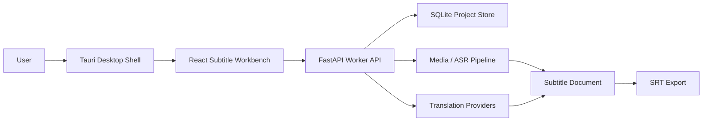

# Diplomat

**Diplomat** 是一款 MIT 许可证开源的本地 AI 字幕工作台，用于把视频中的人声转写成可编辑字幕，并将字幕翻译成目标语言或双语字幕。它面向创作者、课程制作者、独立开发者、字幕组和需要处理跨语言视频内容的用户，重点提供从视频导入、语音转写、字幕校对、翻译到字幕文件导出的完整工作流。

Diplomat 的设计目标是让字幕处理尽可能在本机完成。用户可以保留对视频、音频、字幕和模型配置的控制权，在需要外部翻译服务时也可以明确选择具体服务端点。

## 核心能力

- **视频项目管理**
  为每个视频创建独立项目，保存源视频路径、语言设置、字幕文档、任务状态和导出结果。

- **本地语音转写**
  Worker 负责执行音频分析和字幕草稿生成。项目内置 deterministic fake ASR 便于测试，也预留了 `faster-whisper` 作为真实本地转写提供方。

- **字幕工作台**
  Web 工作台支持查看字幕行、选择字幕片段、编辑起止时间、修改源语言文本、修改译文文本，并保存为结构化字幕文档。

- **字幕翻译**
  支持将源语言字幕翻译成目标语言。当前内置 fake translation provider 用于离线演示和测试，也支持接入 LibreTranslate HTTP 服务。

- **双语字幕**
  字幕行同时保存源文与译文，并记录翻译状态、翻译来源和错误信息。用户可以生成源语言字幕、目标语言字幕或双语字幕。

- **后台任务系统**
  转写和翻译都通过 Worker 后台任务运行，支持任务进度、状态查询、取消和失败后重试。

- **SRT 导出**
  支持导出标准 `.srt` 字幕文件，可选择 `source`、`target` 或 `bilingual` 模式。

- **桌面壳集成**
  桌面端基于 Tauri，提供 Windows-first 的本地应用外壳，并负责与本地 Worker 生命周期集成。

## 产品工作流

1. **创建项目**
   用户输入项目名称、源视频路径、源语言和目标语言。

2. **分析视频音频**
   Worker 读取媒体信息，执行音频提取和语音转写，生成初始字幕文档。

3. **校对字幕**
   用户在字幕工作台中逐行检查时间轴、源文本、说话人和字幕内容。

4. **执行翻译**
   用户选择翻译提供方、源语言、目标语言和翻译模式，启动翻译任务。

5. **编辑译文**
   用户可以手动调整译文，手工修改后的字幕会标记为 `edited`，避免被误认为未经人工审核的机器翻译。

6. **导出字幕**
   用户选择源语言、目标语言或双语 SRT 导出，得到可用于播放器、剪辑工具或后续处理流程的字幕文件。

## 技术架构

Diplomat 采用 monorepo 结构，将桌面壳、Web 工作台、共享数据模型和 Python Worker 分离，便于在本地开发、测试和扩展 AI/媒体处理能力。



### 应用层

- **Desktop Shell**
  位于 `apps/desktop`，使用 Tauri 2 和 Rust 构建 Windows 桌面应用壳。它负责承载前端工作台，并提供本地 Worker 启动、状态检测等桌面能力。

- **Web Workbench**
  位于 `apps/web`，使用 React、TypeScript 和 Vite 构建。它提供字幕编辑、任务控制、翻译设置、项目重开和 SRT 导出界面。

- **Shared Contracts**
  位于 `packages/shared`，使用 TypeScript 和 Zod 定义项目、任务、字幕文档、翻译请求和导出结果的数据结构。Web 和测试共享这些 schema，减少前后端契约漂移。

### Worker 层

- **FastAPI Worker**
  位于 `worker/diplomat_worker/api`，提供项目、字幕、任务、转写、翻译和导出的 HTTP API。

- **Project Store**
  使用 SQLite 保存项目元数据、后台任务、翻译设置和字幕文档路径。字幕文档本身以结构化 JSON 文件保存到项目目录中。

- **Media Pipeline**
  负责媒体预检、音频处理和 ASR provider 调用。FFmpeg/FFprobe 用于媒体探测和音频提取。

- **ASR Providers**
  通过统一接口接入转写引擎。fake provider 用于可重复测试，`faster-whisper` provider 用于本地真实转写。

- **Translation Providers**
  通过统一接口接入翻译引擎。fake provider 用于离线演示，LibreTranslate provider 可连接本地或远程 LibreTranslate 服务。

- **Export Pipeline**
  将结构化字幕文档转换为标准 SRT，支持源文、译文和双语输出。

## 数据模型

Diplomat 的核心数据是 `SubtitleDocument`。它包含：

- 项目与媒体标识。
- 视频时长。
- 说话人列表。
- 字幕样式列表。
- 字幕行列表。

每一条字幕行包含：

- `startMs` / `endMs`：字幕时间范围。
- `sourceLanguage` / `targetLanguage`：源语言和目标语言。
- `sourceText`：源语言字幕文本。
- `translatedText`：目标语言字幕文本。
- `words`：词级时间戳。
- `reviewStatus`：校对状态。
- `translationStatus`：翻译状态。
- `translationOrigin`：翻译来源。
- `translationError`：翻译失败信息。
- `styleOverrides`：单行字幕样式覆盖。

这种结构让 Diplomat 可以同时服务于字幕编辑、机器翻译、人工校对和多格式导出。

## 本地优先与隐私

Diplomat 默认按本地优先方式设计：

- 视频路径、项目数据、任务状态和字幕文档保存在用户本机。
- fake ASR 和 fake translation 不会访问网络。
- `faster-whisper` 可在本地运行模型，模型文件不包含在本仓库中。
- LibreTranslate 只有在用户选择并配置 endpoint 后才会发送字幕文本。
- API key 不写入字幕文档；配置中只保存环境变量名称，Worker 在运行时读取实际值。

## 仓库结构

```text
.
├── apps/
│   ├── desktop/          # Tauri desktop shell
│   └── web/              # React subtitle workbench
├── packages/
│   └── shared/           # Shared TypeScript schemas and contracts
├── worker/               # Python FastAPI worker, media pipeline, ASR, translation, export
├── docs/                 # Product, design, and development documents
├── scripts/              # Local verification scripts
├── package.json          # JavaScript workspace root
├── pyproject.toml        # Python tooling root
└── LICENSE               # MIT license
```

## 技术栈

- **Desktop**：Tauri 2, Rust
- **Frontend**：React, TypeScript, Vite
- **Shared Schema**：Zod
- **Worker API**：Python 3.12, FastAPI, Pydantic, Uvicorn
- **Storage**：SQLite + JSON subtitle documents
- **Media**：FFmpeg / FFprobe
- **ASR**：fake provider, optional `faster-whisper`
- **Translation**：fake provider, optional LibreTranslate
- **Testing**：Vitest, pytest, Rust unit tests
- **Package Management**：pnpm, Corepack, Python editable install

## Requirements

- Windows 11 or a current Windows development environment.
- Node.js 24 or newer.
- pnpm via Corepack.
- Python 3.12.
- Rust stable toolchain for Tauri.
- FFmpeg available on `PATH` for media integration workflows.

## Setup

```powershell
corepack enable
pnpm install
python -m venv .venv
.\.venv\Scripts\Activate.ps1
python -m pip install -e ".\worker[dev]"
```

Optional local ASR support:

```powershell
python -m pip install -e ".\worker[dev,asr]"
```

## Run The Web Workbench

Start the Worker:

```powershell
python -m uvicorn diplomat_worker.api.app:app --host 127.0.0.1 --port 8765
```

Start the Web app:

```powershell
corepack pnpm --dir apps/web dev
```

Open:

```text
http://localhost:1420
```

If another local service already uses the default Worker port, run the Worker on another port and point the Web app at it:

```powershell
$env:DIPLOMAT_CORS_ORIGINS = "http://127.0.0.1:1421"
python -m uvicorn diplomat_worker.api.app:app --host 127.0.0.1 --port 8767
```

```powershell
$env:VITE_DIPLOMAT_WORKER_BASE_URL = "http://127.0.0.1:8767"
corepack pnpm --dir apps/web exec vite --host 127.0.0.1 --port 1421 --strictPort
```

## Verify

```powershell
.\scripts\check.ps1
```

This runs the shared package tests, Web tests, TypeScript checks, Worker tests, and desktop Rust tests.

## Version

Current project version: **0.32.0**
Release tag: **v0.32**

## License

Diplomat is released under the [MIT License](LICENSE).

AI model weights are not included in this repository and remain governed by their upstream licenses.
