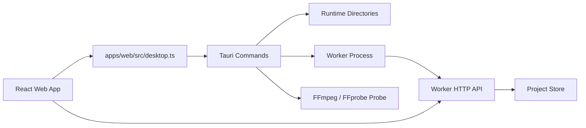

# Diplomat 0.21 Desktop Runtime Foundation

Checkpoint date: 2026-06-14

## Goal

Diplomat 0.21 makes the Windows desktop application own the local runtime foundation required by the 0.3 release. After this stage, users should no longer need to understand how to start the Worker manually, where application data lives, where logs are written, or whether FFmpeg is visible to the desktop app.

0.21 is a runtime foundation stage. It does not add new AI capability, model downloads, professional timeline editing, export formats, or installer release artifacts. It creates the desktop/runtime contract those later stages depend on.

## Current Baseline

0.2 already includes:

- Tauri desktop shell under `apps/desktop`.
- React web workbench under `apps/web`.
- Python FastAPI Worker under `worker`.
- Desktop commands for:
  - `pick_video_file`.
  - `start_worker`.
  - `stop_worker`.
  - `worker_status`.
  - `open_path_in_file_manager`.
- A fixed Worker endpoint at `http://127.0.0.1:8765`.
- Worker storage defaulting to `%LOCALAPPDATA%\Diplomat\diplomat.db` when `LOCALAPPDATA` exists.
- Basic Worker logs under `%LOCALAPPDATA%\Diplomat\logs`.
- Browser-mode fallback through `VITE_DIPLOMAT_WORKER_BASE_URL`.

The current desktop runtime is still development-oriented:

- Worker startup depends on locating the repository root.
- Worker startup assumes `python` and editable source checkout access.
- Runtime directories are implicit and not exposed as a first-class desktop contract.
- The web app has no complete desktop runtime status surface.
- FFmpeg is only a Worker/media dependency, not a desktop-visible runtime capability.
- Opening paths is implemented manually through shell commands instead of a formal runtime contract.
- Port conflict detection exists but status details are too narrow for release diagnostics.

## Product Scope

### In Scope

- Define stable app-owned runtime directories:
  - data.
  - projects.
  - models.
  - downloads.
  - exports.
  - cache.
  - logs.
  - diagnostics.
- Add a desktop runtime status contract that covers:
  - runtime mode.
  - Worker endpoint.
  - Worker status.
  - Worker owner.
  - Worker message.
  - app directories.
  - FFmpeg status.
  - FFmpeg version.
  - FFmpeg path.
  - FFprobe status.
  - FFprobe version.
  - FFprobe path.
  - recent diagnostic log paths.
- Improve Worker lifecycle behavior for desktop development mode.
- Keep browser-only development mode functional.
- Add FFmpeg/FFprobe discovery and version checks from the desktop shell.
- Ensure runtime directory creation is idempotent.
- Surface runtime diagnostics in the Settings page.
- Add focused tests for Rust desktop runtime helpers and Web runtime status rendering.
- Document manual desktop verification.

### Out Of Scope

- Shipping a final Windows installer.
- Bundling an actual FFmpeg binary into the repository.
- Downloading or managing AI models.
- Replacing fake ASR or fake translation.
- Professional waveform or timeline editing.
- Burned-in video export.
- Cross-platform runtime polish beyond keeping existing non-Windows code paths compiling.
- Full app updater behavior.

## Architecture

0.21 introduces a clearer boundary between desktop runtime state and Worker API data.



### Desktop Layer

The desktop layer owns operating-system concerns:

- app directory discovery and creation.
- Worker process lifecycle.
- runtime diagnostics.
- file picker.
- opening files or directories in File Explorer.
- FFmpeg/FFprobe executable discovery and version checks.

The desktop layer must not parse subtitle documents or own project business logic.

### Worker Layer

The Worker remains responsible for:

- durable project data.
- project database and subtitle documents.
- media probing.
- task execution.
- ASR/translation/export work in later stages.

0.21 may pass runtime environment variables into the Worker process, especially `DIPLOMAT_DATA_DIR`, but it should not rewrite Worker storage architecture.

The Worker default runtime must also consume `DIPLOMAT_FFMPEG_PATH` and `DIPLOMAT_FFPROBE_PATH` so desktop-discovered or future bundled tool paths are used consistently by project video probing and later analysis jobs.

### Web Layer

The Web app renders runtime diagnostics and controls:

- Worker start/stop/status in desktop mode.
- Worker URL fallback in browser mode.
- FFmpeg/FFprobe status.
- app directories and log paths.
- open directory actions when running inside Tauri.

The Web app should continue to treat Worker HTTP API data separately from desktop runtime state.

## Runtime Directory Contract

In desktop mode, 0.21 should standardize these directories under the Windows local app data root:

```text
%LOCALAPPDATA%\Diplomat\
  data\
  projects\
  models\
  downloads\
  exports\
  cache\
  logs\
  diagnostics\
```

The exact paths must come from the desktop runtime command rather than being reconstructed in the Web app. Browser-only mode can display the configured Worker URL and a clear message that desktop runtime directories are unavailable.

Worker storage should use:

```text
%LOCALAPPDATA%\Diplomat\data\diplomat.db
%LOCALAPPDATA%\Diplomat\data\projects\<project_id>\
```

This may require passing `DIPLOMAT_DATA_DIR=%LOCALAPPDATA%\Diplomat\data` when the desktop shell starts the Worker.

## Runtime Status Contract

0.21 should add a single desktop command:

```text
runtime_status()
```

The command returns a serializable object equivalent to:

```json
{
  "mode": "desktop",
  "worker": {
    "status": "running",
    "endpoint": "http://127.0.0.1:8765",
    "owner": "diplomat",
    "message": "Diplomat Worker is reachable."
  },
  "directories": {
    "data": "C:/Users/<user>/AppData/Local/Diplomat/data",
    "projects": "C:/Users/<user>/AppData/Local/Diplomat/data/projects",
    "models": "C:/Users/<user>/AppData/Local/Diplomat/models",
    "downloads": "C:/Users/<user>/AppData/Local/Diplomat/downloads",
    "exports": "C:/Users/<user>/AppData/Local/Diplomat/exports",
    "cache": "C:/Users/<user>/AppData/Local/Diplomat/cache",
    "logs": "C:/Users/<user>/AppData/Local/Diplomat/logs",
    "diagnostics": "C:/Users/<user>/AppData/Local/Diplomat/diagnostics"
  },
  "ffmpeg": {
    "status": "available",
    "path": "ffmpeg",
    "version": "ffmpeg version ...",
    "message": "FFmpeg is available."
  },
  "ffprobe": {
    "status": "available",
    "path": "ffprobe",
    "version": "ffprobe version ...",
    "message": "FFprobe is available."
  },
  "diagnostics": {
    "workerStdoutLog": "C:/Users/<user>/AppData/Local/Diplomat/logs/worker.stdout.log",
    "workerStderrLog": "C:/Users/<user>/AppData/Local/Diplomat/logs/worker.stderr.log"
  }
}
```

Allowed tool statuses:

- `available`
- `missing`
- `error`

Allowed Worker statuses continue to include:

- `running`
- `starting`
- `stopped`
- `blocked`

## FFmpeg Strategy For 0.21

The 0.3 release will bundle FFmpeg, but 0.21 should not commit a binary. It should implement the discovery and reporting layer that later accepts a bundled binary path.

Discovery order:

1. Explicit environment variable:
   - `DIPLOMAT_FFMPEG_PATH`
   - `DIPLOMAT_FFPROBE_PATH`
2. Future bundled runtime directory under the desktop resource/app path.
3. `ffmpeg` and `ffprobe` from `PATH`.

0.21 must report missing FFmpeg and FFprobe clearly without preventing the app shell from opening.

The Worker default runtime should use the same environment variables. When `DIPLOMAT_FFPROBE_PATH` is set, project creation should probe videos with that executable instead of hard-coding `ffprobe` from `PATH`.

The release legal check remains in 0.30. 0.21 should record the need to avoid incompatible FFmpeg binary choices and to preserve version/license metadata.

Reference context:

- Tauri 2 documents path utilities and base directories in the official path API documentation.
- Tauri 2 documents file opening/revealing behavior through the Opener plugin.
- Tauri 2 filesystem documentation emphasizes scoped path access for frontend file APIs. 0.21 keeps privileged filesystem operations inside Rust commands rather than exposing broad frontend filesystem access.

## User Experience

The Settings page should gain a runtime diagnostics section.

Desktop mode should show:

- Worker status and endpoint.
- Start Worker action.
- Stop Worker action.
- FFmpeg status.
- FFprobe status.
- app directory paths.
- log path actions.
- open directory buttons for safe app-owned directories.

Browser mode should show:

- configured Worker URL.
- Worker HTTP health status.
- message that desktop runtime controls are unavailable outside Tauri.

The UI should remain dense and desktop-like. It should not become a setup wizard in 0.21.

## Testing Requirements

### Rust Tests

Add focused tests for:

- runtime directory derivation from a supplied base path.
- directory creation.
- Worker status classification.
- FFmpeg/FFprobe status classification for success, missing executable, and command error.
- Worker environment variables passed to the process command builder.
- log file path generation.

Process-spawning tests should avoid launching a real Worker unless explicitly documented as manual verification. Unit tests should extract pure helper functions where needed.

### TypeScript Tests

Add focused tests for:

- desktop runtime bridge calls `runtime_status`.
- runtime status query is disabled outside desktop mode.
- Settings page renders browser-mode fallback.
- Settings page renders desktop runtime diagnostics with mocked desktop status.
- i18n keys exist in Chinese and English.

### Manual Verification

Manual verification for 0.21:

1. Run the web and desktop development app.
2. Open Settings.
3. Confirm Worker status appears.
4. Start Worker from the desktop app.
5. Confirm Worker reaches `running`.
6. Confirm logs are written under `%LOCALAPPDATA%\Diplomat\logs`.
7. Confirm app directory paths are shown.
8. Confirm FFmpeg and FFprobe status are shown.
9. Import a local video through the desktop picker.
10. Create a project.
11. Confirm the project is stored under the 0.21 data directory.
12. Stop Worker from the desktop app.

### Focused Verification Commands

```powershell
corepack pnpm --dir apps/desktop test
corepack pnpm --dir apps/web exec vitest run src/pages/SettingsPage.test.tsx src/i18n/i18n.test.ts
corepack pnpm --dir apps/web typecheck
python -m pytest worker/tests/api/test_runtime.py -q
```

### Stage Gate Evidence To Capture

The 0.21 stage gate review must record:

- `runtime_status` JSON from a desktop development run.
- Worker log paths under `%LOCALAPPDATA%\Diplomat\logs`.
- FFmpeg and FFprobe status shown in Settings.
- Whether FFmpeg and FFprobe were found through `PATH` or environment variables.
- Project creation storage path after Worker starts from the desktop shell.
- Worker default runtime honors `DIPLOMAT_FFMPEG_PATH` and `DIPLOMAT_FFPROBE_PATH`.

## Acceptance Criteria

0.21 is complete when:

- The desktop app exposes a stable `runtime_status` command.
- The desktop app starts the Worker with `DIPLOMAT_DATA_DIR` pointing at the 0.21 data directory.
- The Settings page shows desktop runtime status and browser-mode fallback.
- FFmpeg and FFprobe availability are detected and displayed.
- Runtime logs are written to a predictable app log directory.
- Safe open-directory actions exist for app-owned runtime directories.
- Existing project center and workbench flows still function.
- Focused Rust, TypeScript, and i18n tests pass.
- Full repository verification passes.
- A stage gate review records automated and manual verification evidence.

## Known Risks

- Packaged Worker startup cannot be fully solved until installer/sidecar work later in 0.3.
- FFmpeg binary distribution is intentionally deferred; 0.21 only builds the detection contract.
- Native file manager behavior on Windows can vary with path quoting; tests should cover command argument generation where possible.
- Fixed port `8765` remains acceptable for 0.21, but later packaging work may need a more flexible allocation strategy.
