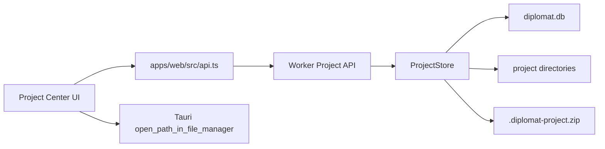

# Diplomat 0.22 Complete Project Center

Checkpoint date: 2026-06-14

## Goal

Diplomat 0.22 turns Project Center from a recent-project list into a local project library. After this stage, users can find, inspect, clean, back up, restore, open, and safely delete projects without knowing the internal `%LOCALAPPDATA%\Diplomat\data\projects` folder structure.

0.22 does not add real ASR, local translation models, timeline editing, or installer packaging. It completes project management surfaces and Worker APIs that later AI, editing, and export stages depend on.

## Current Baseline

0.21 provides:

- Desktop-owned runtime directories.
- Worker start/stop/status and runtime diagnostics.
- App-owned data directory through `DIPLOMAT_DATA_DIR`.
- Project creation through the Worker API.
- A Project Center table showing recent projects.
- Browser-mode video path fallback and desktop file picker.
- Open path in file manager through a Tauri command.

Project Center is still incomplete:

- no search.
- no status filters.
- no delete or safe destructive confirmation.
- no disk usage, cache usage, or export usage visibility.
- no backup/export package.
- no import/restore package.
- no project folder/export folder/log folder actions.
- no project cache cleanup or export cleanup.
- no derived status beyond subtitle-document presence.
- no explicit corrupted, missing-media, or migration-failed states.

## Product Scope

### In Scope

- Project list search by:
  - project name.
  - source video path.
  - project id.
  - language pair.
- Project status filter.
- Project status derivation:
  - `not_transcribed`.
  - `transcribed`.
  - `translated`.
  - `dirty_draft`.
  - `exported`.
  - `failed`.
  - `corrupted`.
  - `migration_failed`.
- Project diagnostics:
  - source video exists.
  - project directory exists.
  - subtitle document load state.
  - latest task status.
  - active task count.
  - failed task count.
  - subtitle line count.
  - translated line count.
  - export count.
  - total disk usage.
  - cache usage.
  - export usage.
- Safe destructive operations:
  - delete project database row.
  - optionally delete project files.
  - refuse unsafe file deletion outside the app data root.
  - require confirmation in the UI.
- Project maintenance actions:
  - open project folder.
  - open export folder.
  - open log folder.
  - clean cache.
  - clean exports.
- Project backup package:
  - metadata manifest.
  - subtitle document when present.
  - translation settings when present.
  - exports when present.
  - references to source media path.
- Project import/restore package:
  - validate package manifest.
  - create a new project id.
  - restore subtitle document.
  - restore translation settings.
  - restore export files.
  - preserve original source-media reference.
- Clear empty, unavailable, corrupted, and migration-failed states.
- Focused Worker, shared schema, API, query, i18n, and Project Center UI tests.

### Out Of Scope

- Copying source video media into project backups.
- Cross-machine media relinking UI.
- Full database repair tooling.
- Versioned project migrations beyond the existing SQLite migration layer.
- Bulk selection and batch project operations.
- Cloud backup or sync.
- Sample projects.
- New desktop runtime commands beyond reusing `open_path_in_file_manager`.
- Real ASR or translation state beyond task/subtitle-derived summaries.

## Architecture

0.22 keeps project management in the Worker because the Worker owns durable project data. The Web app requests richer project metadata and sends maintenance commands. The desktop shell only opens app-owned paths in File Explorer.



### Shared Contract

`@diplomat/shared` should define the project status and maintenance response schemas so Web tests validate real API payloads.

`ProjectResponse` should gain a `diagnostics` object instead of scattering many new top-level fields. This keeps future stages able to add diagnostics without bloating table-oriented fields.

### Worker API

New or extended endpoints:

```text
GET    /projects
DELETE /projects/{project_id}?deleteFiles=true
POST   /projects/{project_id}/cleanup/cache
POST   /projects/{project_id}/cleanup/exports
POST   /projects/{project_id}/backup
POST   /projects/import
```

`GET /projects` continues returning the same list envelope, but each project includes diagnostics.

`DELETE /projects/{project_id}` must delete related task and translation rows before deleting the project row. File deletion must only proceed for safe paths under the Worker data root.

Cleanup operations remove the contents of safe project child directories and then recreate the empty directories.

Backup packages should be ordinary zip files with this structure:

```text
manifest.json
subtitle.diplomat.json
translation-settings.json
exports/
```

The package extension should be:

```text
.diplomat-project.zip
```

### Web UI

Project Center should remain dense and desktop-like:

- toolbar row with search, status filter, and import/create actions.
- table-first layout.
- status badges.
- compact diagnostics per row.
- per-row action menu for maintenance actions.
- modal confirmation for destructive actions.
- no marketing-style empty page.
- no nested cards.

The design system search for this stage suggested micro-interactions and strong focus states, but its portfolio-grid and indigo-heavy visual direction is rejected because Diplomat is a productivity desktop application. 0.22 should follow the existing quiet Mantine desktop-tool style.

## User Experience

### Primary Project Center Workflow

1. User opens Project Center.
2. User sees project count, Worker status, search, status filter, and table.
3. User searches by name/path/language/id.
4. User filters to failed, exported, translated, or not transcribed projects.
5. User opens a project or opens a project folder.
6. User cleans cache or exports from the row action menu.
7. User backs up a project and opens the backup folder.
8. User imports a backup package from a local path.
9. User deletes a project through a confirmation modal that clearly states whether files will be removed.

### Status Language

The UI should show short labels:

| Status | English | Chinese |
| --- | --- | --- |
| `not_transcribed` | Not transcribed | 未转写 |
| `transcribed` | Transcribed | 已转写 |
| `translated` | Translated | 已翻译 |
| `dirty_draft` | Draft changed | 草稿已变更 |
| `exported` | Exported | 已导出 |
| `failed` | Failed | 失败 |
| `corrupted` | Corrupted | 已损坏 |
| `migration_failed` | Migration failed | 迁移失败 |

Warnings should be visible but compact:

- missing source video.
- missing project directory.
- corrupted subtitle document.
- unsafe project path.
- migration failed.

## Data Safety

Deletion and cleanup must never recursively remove arbitrary user paths.

Rules:

- Project child directories are safe only when their resolved path is within `ProjectStore.root_dir`.
- Project child directory names are allow-listed:
  - `cache`.
  - `exports`.
  - `logs`.
  - `backups`.
- Project directory deletion is safe only when the resolved project directory is within `root_dir / "projects"` or within `root_dir`.
- Unsafe paths should return a clear error and leave database rows untouched.
- Backup import should validate the zip manifest before writing files.
- Backup import should create a new project id and never overwrite an existing project.

## Testing Requirements

### Shared Tests

- `ProjectResponseSchema` parses diagnostics.
- maintenance response schemas parse cleanup, backup, delete, and import responses.
- project status enum rejects unknown values.

### Worker Store Tests

- diagnostics derive `not_transcribed`.
- diagnostics derive `transcribed`.
- diagnostics derive `translated`.
- diagnostics derive `exported`.
- diagnostics derive `failed`.
- corrupted subtitle JSON yields `corrupted`.
- missing source video adds a warning.
- disk usage counts project files.
- cache cleanup removes cache files only.
- export cleanup removes export files only.
- delete removes database rows and safe project directory.
- delete refuses unsafe project directory deletion.
- backup zip contains manifest and subtitle document.
- import backup creates a new project id and restores subtitle data.

### Worker API Tests

- `GET /projects` includes diagnostics.
- `DELETE /projects/{project_id}` returns deleted file count and invalidates list.
- cleanup endpoints return bytes freed.
- backup endpoint returns package path.
- import endpoint creates a restorable project.
- migration failure returns a clear Worker error.

### Web Tests

- Project Center renders search and status filter.
- search filters by project name and source path.
- status filter filters derived statuses.
- row action buttons call open path, backup, cleanup, delete, and import APIs.
- delete requires confirmation before API call.
- corrupted and migration-failed states are visible.
- i18n keys exist in English and Chinese.

### Manual Verification

1. Run the Worker and Web app.
2. Create at least three projects:
   - no subtitle document.
   - subtitle document only.
   - exported SRT.
3. Confirm search filters by name and source path.
4. Confirm status filter isolates each status.
5. Clean cache and confirm cache usage drops.
6. Clean exports and confirm export usage drops.
7. Back up one project and confirm a `.diplomat-project.zip` is created.
8. Import the backup package and confirm a new project appears.
9. Delete the imported project with file deletion enabled.
10. Confirm the project disappears and its project folder is removed.

### Focused Verification Commands

```powershell
python -m pytest worker/tests/storage/test_project_store.py worker/tests/api/test_app.py -q
corepack pnpm --dir packages/shared test
corepack pnpm --dir apps/web exec vitest run src/pages/ProjectCenterPage.test.tsx src/i18n/i18n.test.ts
corepack pnpm --dir apps/web typecheck
```

### Full Verification

```powershell
.\scripts\check.ps1
```

## Acceptance Criteria

0.22 is complete when:

- Project Center supports search and status filtering.
- Each project row shows derived status and diagnostics.
- Users can open project, export, and log folders where desktop APIs are available.
- Users can clean cache and exports safely.
- Users can back up and import project packages.
- Users can delete projects only after confirmation.
- Unsafe project file deletion is refused.
- Empty, Worker unavailable, corrupted, and migration-failed states are visible.
- Focused tests pass.
- Full repository verification passes.
- A 0.22 stage gate review records verification evidence and limitations.

## Known Risks

- Real dirty draft detection is limited until 0.27 autosave drafts.
- Project backup preserves media references, not media files.
- Importing a backup on another machine may require users to relink missing source video in a later release.
- Large project directories may make disk usage scanning expensive; 0.22 should keep scanning simple and can optimize later if real data shows a problem.
