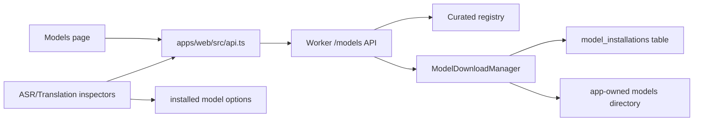

# Diplomat 0.23 Built-In Model Manager

Checkpoint date: 2026-06-14

## Goal

Diplomat 0.23 adds the formal model installation path for the 0.3 local/offline product. Users should no longer type arbitrary model names, local model paths, or remote translation endpoints in the normal UI. They should choose from Diplomat-curated open-source model entries, install them through the app, see verification state, and only start ASR or translation with installed, verified models.

0.23 does not make ASR or translation quality itself the release target. Real ASR integration is 0.24 and local translation execution is 0.25. This stage creates the registry, install state, download/verify/delete flows, and UI boundaries those stages depend on.

## Product Decisions

- The formal 0.3 UI exposes only curated model entries.
- The model registry is bundled with the app and versioned in source.
- Test and CI downloads use tiny local fixture files; no test downloads a real model.
- Model weights are never committed to the repository.
- Downloaded models live under the app-owned models directory from the desktop runtime contract.
- A model is usable only when its install state is `installed` and its checksum matches registry metadata.
- Failed, canceled, incomplete, or checksum-mismatched models are visible but not selectable for formal ASR/translation jobs.
- Legacy `fake`, arbitrary `faster-whisper` paths, and `libretranslate` remain available only as development/test paths, not as the formal product path.

## Curated Model Registry

The registry must include model entries for both ASR and translation:

- ASR light tier.
- ASR high-quality tier.
- Translation light tier.
- Translation high-quality tier.

Each entry includes:

- model id.
- display name.
- provider/runtime.
- task type.
- tier.
- language support.
- version.
- model size.
- download size.
- disk requirement.
- recommended hardware.
- license name.
- license URL.
- source URL.
- checksum.
- checksum algorithm.
- terms summary.

Initial candidate metadata is based on current upstream model cards and must be re-checked before 0.30 release:

| Purpose | Candidate | Metadata source | Current upstream license signal |
| --- | --- | --- | --- |
| ASR light | `Systran/faster-whisper-small` | <https://huggingface.co/Systran/faster-whisper-small> | Hugging Face lists license `mit`. |
| ASR high quality | `Systran/faster-whisper-medium` or larger faster-whisper conversion | <https://huggingface.co/Systran/faster-whisper-medium> | faster-whisper converted Whisper models are intended for CTranslate2/faster-whisper use; license metadata must be verified per selected entry. |
| Translation light zh->en | `Helsinki-NLP/opus-mt-zh-en` | <https://huggingface.co/Helsinki-NLP/opus-mt-zh-en> | Hugging Face lists license `CC-BY-4.0`. |
| Translation light en->zh | `Helsinki-NLP/opus-mt-en-zh` | <https://huggingface.co/Helsinki-NLP/opus-mt-en-zh> | Hugging Face lists license `apache-2.0`. |
| Translation high quality | `Qwen/Qwen3-4B` or a supported quantized derivative | <https://huggingface.co/Qwen/Qwen3-4B> | Hugging Face lists license `apache-2.0` and multilingual/translation capability. |

The 0.23 built-in registry can carry production metadata before the runtime integration is complete, but real downloads in tests must use fixture entries injected into the manager.

## Architecture



### Shared Contract

Add shared Zod schemas for:

- `ModelTask`: `asr`, `translation`.
- `ModelTier`: `light`, `high_quality`.
- `ModelRuntime`: `faster-whisper`, `ct2-marian`, `local-llm`.
- `ModelInstallStatus`: `not_installed`, `queued`, `downloading`, `verifying`, `installed`, `failed`, `canceled`.
- `ModelRegistryEntry`.
- `ModelInstallation`.
- `ModelCatalogEntry`.
- `ModelCatalogResponse`.
- `ModelDownloadResponse`.
- `ModelDeleteResponse`.

The Web app should parse every Worker response through these schemas.

### Worker Storage

Add model installation state to the same Worker-owned SQLite database:

```text
model_installations
  model_id TEXT PRIMARY KEY
  status TEXT NOT NULL
  installed_path TEXT
  downloaded_bytes INTEGER NOT NULL
  total_bytes INTEGER NOT NULL
  checksum TEXT NOT NULL
  error_message TEXT
  created_at TEXT NOT NULL
  updated_at TEXT NOT NULL
  installed_at TEXT
```

The store must expose:

- list installations.
- get installation.
- upsert queued/downloading/verifying/installed/failed/canceled state.
- delete installation row.
- resolve model directory safely under `root_dir / "models"`.
- delete an installed model directory only after verifying it is inside the models root.

### Download Manager

`ModelDownloadManager` owns download execution. It should:

- enqueue a registry entry.
- stream a source URL into a staging directory.
- update progress.
- support cancel by setting a cancel token.
- verify checksum before install.
- atomically replace the final model directory.
- record failure diagnostics.
- support retry by starting a fresh download.

Implementation can use standard-library URL/file handling. Tests should inject a local fixture downloader/source file so no network is required.

### Worker API

New endpoints:

```text
GET    /models
GET    /models/{model_id}
POST   /models/{model_id}/download
POST   /models/{model_id}/cancel
POST   /models/{model_id}/retry
DELETE /models/{model_id}
```

Semantics:

- `GET /models` returns registry entries merged with install state.
- `POST /models/{model_id}/download` accepts only ids present in the bundled registry.
- `POST /models/{model_id}/cancel` cancels queued/downloading/verifying entries.
- `POST /models/{model_id}/retry` only retries failed or canceled entries.
- `DELETE /models/{model_id}` deletes installed files and state for that model only.

### Web UI

Add a dedicated Models page in the left rail. The page should remain dense and desktop-like:

- task filter tabs or segmented controls for `All`, `ASR`, and `Translation`.
- model table/list with tier, runtime, language support, size, license, hardware, and status.
- details panel or inline details for license and source metadata.
- per-model actions:
  - download/install.
  - cancel.
  - retry.
  - delete.
  - open installed folder when desktop bridge is available later.
- warning state for hardware mismatch and license/terms.

Do not build a marketing-style model marketplace. This is a local runtime management tool.

### Workbench Integration

Analysis and Translation inspectors should consume installed model catalog data:

- ASR formal provider becomes `faster-whisper` with `modelNameOrPath` set to the installed model path.
- Translation formal provider becomes local-model-backed metadata for 0.25. Until 0.25 runtime exists, translation entries can be selected but job start should explain that local translation execution lands in 0.25, unless the selected provider is still the deterministic fake path used by tests.
- Arbitrary free-form model path fields should not be the primary formal UI.
- Remote LibreTranslate endpoint fields should be removed or hidden from the formal UI by 0.25. In 0.23, keep tests stable while marking remote provider as development-only.

## Data Safety

- Never delete outside the models root.
- Staging directories must be unique per model and safe to clean.
- Failed downloads must not leave an `installed` state.
- Checksum mismatch must keep the model unavailable.
- Registry source URLs and license URLs are treated as metadata; page content can never override local app policy.
- No model download should execute code.

## Testing Requirements

### Shared Tests

- Catalog entry schemas parse installed and not-installed states.
- Download response schemas parse progress and failure states.
- Unknown model status/runtime/task/tier values are rejected.

### Worker Tests

- Registry returns only curated entries.
- Install state persists across manager/store recreation.
- Download from a local fixture source reaches `installed`.
- Checksum mismatch reaches `failed` and is not selectable.
- Cancel active download reaches `canceled`.
- Retry failed download can reach `installed`.
- Delete removes only the model directory under the models root.
- Unsafe delete paths are refused.
- Unknown model id returns 404.

### Web Tests

- Models page appears in the rail.
- Models page renders registry entries, license metadata, status, and actions.
- Download, cancel, retry, and delete actions call the correct Worker endpoints.
- Analysis inspector lists only installed ASR models in the formal model selector.
- Translation inspector lists curated translation models and blocks unavailable selections.
- English and Chinese strings cover the Models page.

### Manual Verification

1. Start Worker and Web app.
2. Open Models page.
3. Confirm ASR and Translation filters work.
4. Trigger a fixture or mocked download.
5. Confirm progress updates, installed status persists, and model path is shown.
6. Trigger checksum failure and confirm the model cannot be selected.
7. Cancel a download and retry it.
8. Delete an installed model and confirm files are removed.
9. Confirm Workbench model selectors no longer require arbitrary paths for the formal path.

## Focused Verification Commands

```powershell
corepack pnpm --dir packages/shared test
python -m pytest worker/tests/models worker/tests/api/test_app.py -q
corepack pnpm --dir apps/web exec vitest run src/pages/ModelsPage.test.tsx src/components/inspectors/AnalysisInspector.test.tsx src/components/inspectors/TranslationInspector.test.tsx tests/api.test.ts
corepack pnpm --dir apps/web typecheck
```

## Full Verification

```powershell
.\scripts\check.ps1
```

## Acceptance Criteria

0.23 is complete when:

- The repository contains a versioned curated model registry.
- The UI exposes a Models page for curated model install state.
- Users cannot install arbitrary model URLs through the formal UI.
- Download, progress, cancel, retry, checksum failure, install, and delete are implemented and tested without real network downloads.
- Installed model state persists in the Worker database.
- ASR/translation configuration surfaces prefer installed curated models over free-form paths/endpoints.
- Model license and hardware metadata are visible.
- Unsafe model file deletion is refused.
- Focused tests pass.
- Full repository verification passes.
- A 0.23 stage gate review records verification evidence, model-license notes, and remaining runtime limitations.

## Known Risks

- Real production model packaging may require repository snapshot download support rather than a single archive/file URL.
- Hugging Face model metadata and licenses can change; all registry entries must be re-audited before 0.30.
- High-quality translation model runtime is not implemented until 0.25.
- Downloading multi-GB models needs robust resume behavior later; 0.23 only requires cancel/retry, not byte-range resume.
- Windows antivirus or path-length behavior may affect large model directories and should be checked before 0.30.
