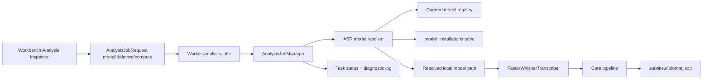

# Diplomat 0.24 Real Local ASR

Checkpoint date: 2026-06-14

## Goal

Diplomat 0.24 turns local ASR from a development fallback into the formal transcription path. Users should start transcription from an installed curated ASR model, see accurate task progress, cancel or retry failures, and receive an editable subtitle document generated by a real local faster-whisper runtime.

This stage keeps deterministic fake ASR for tests and internal demo flows. It does not add local translation, waveform editing, text subtitle export hardening, or burned-in video export.

## Product Decisions

- The formal ASR path is `faster-whisper` using a model installed by the 0.23 model manager.
- The Worker validates a selected model by curated `modelId`, not by arbitrary user-entered paths.
- Absolute installed paths may be passed to the runtime after Worker validation, but they should not be the stable user-facing ASR identity.
- Subtitle `aiOrigin.model` should prefer the curated model id when available.
- GPU is the recommended production path. The UI defaults the formal ASR path to CUDA-oriented settings while keeping a CPU/int8 fallback selectable for short media and development machines.
- Hardware and model compatibility checks happen before or at task start and produce actionable diagnostics.
- Fake ASR remains available for tests and explicit development wiring, but it is not the primary formal desktop UI.
- The 0.24 runtime can transcribe a real video when a valid faster-whisper model directory is installed and recorded as installed. Final production model package URLs, pinned checksums, and release license audit remain tracked through 0.30.

## Scope

### Included

- Shared `AnalysisJobRequest` support for `modelId`.
- Worker ASR model resolver that binds `modelId` to an installed curated model directory.
- Worker compatibility checks for task type, runtime, language, install status, model files, device, and compute type.
- Faster-whisper wrapper hardening:
  - lazy dependency import.
  - clear missing-dependency message.
  - real segment and word timing conversion.
  - cancellation checks while consuming generated segments.
  - progress messages that remain meaningful for UI polling.
- Analysis job queue integration:
  - reject invalid formal ASR requests before queueing when possible.
  - re-check model availability when the task starts.
  - fail with diagnostic log paths if an installed model disappears or runtime loading fails.
  - preserve cancel and retry semantics.
- Web Workbench integration:
  - installed curated ASR model selector uses `modelId`.
  - no formal arbitrary model-path input.
  - clear empty state when no ASR model is installed.
  - device and compute type controls remain visible for GPU/CPU fallback.
  - start is blocked until an installed usable ASR model is selected.

### Excluded

- Local translation execution. That lands in 0.25.
- Waveform, timeline, split/merge, undo/redo, autosave, and editor polish. Those land in 0.26 and 0.27.
- VTT/ASS export and style presets. Those land in 0.28.
- Burned-in video export. That lands in 0.29.
- Windows installer and final model/FFmpeg license audit. Those land in 0.30.
- Download resume and production-scale model package integrity manifests. Those remain release-hardening work unless needed earlier by a blocking runtime issue.

## Architecture



### Shared Contract

`AnalysisJobRequest` gains:

- `modelId: string | null`

Semantics:

- `provider: "faster-whisper"` with `modelId` is the formal 0.24 path.
- `modelNameOrPath` remains a development-only escape hatch outside the formal UI.
- `provider: "fake"` remains test/demo only.

### Worker Model Resolution

The Worker adds a focused ASR resolver that receives:

- `AsrModelConfig`.
- project source language.
- `ProjectStore`.
- curated model registry.
- an optional unmanaged-model allowance used only by explicit development wiring.

Resolution rules:

- `fake` returns unchanged after source-language fallback.
- `faster-whisper` with `modelId` must match a bundled registry entry.
- The entry must have task `asr`, runtime `faster-whisper`, and provider `faster-whisper`.
- The project/request source language must be in the entry languages.
- Install state must be `installed`.
- `installedPath` must exist and remain inside the app-owned models root.
- CPU accepts `int8` and `float32`.
- CUDA accepts `int8`, `float16`, and `float32`.
- Unknown device or compute values are rejected with stable error codes.

### Worker Task Behavior

Creation-time validation catches most user errors before a task is queued. Start-time validation runs again to catch races such as deleting a model after the job is queued.

Blocking failures should record:

- stable error code.
- user-actionable message.
- diagnostic log path when the task had started.

Expected error codes include:

- `ASR_MODEL_REQUIRED`
- `ASR_MODEL_NOT_FOUND`
- `ASR_MODEL_NOT_COMPATIBLE`
- `ASR_MODEL_NOT_INSTALLED`
- `ASR_MODEL_FILES_MISSING`
- `ASR_LANGUAGE_UNSUPPORTED`
- `ASR_DEVICE_UNSUPPORTED`
- `ASR_COMPUTE_UNSUPPORTED`
- `ASR_RUNTIME_UNAVAILABLE`

### Faster-Whisper Wrapper

The wrapper keeps `faster_whisper` imported lazily so normal tests and non-ASR flows do not require the optional dependency. When available, it constructs `WhisperModel(model_path, device, compute_type)` and converts returned segments/words to Diplomat's `AsrResult`.

The wrapper reports progress at:

- model loading.
- transcription started.
- segment capture.
- transcription completed.

The wrapper checks cancellation before loading, before transcription, and while iterating segments. Faster-whisper cannot always interrupt inside a native inference call immediately, so cancellation is best-effort once Python regains control.

### Web UI

The formal Workbench Analysis inspector should:

- show installed usable ASR models from the model catalog.
- store the selected `modelId` in the analysis config.
- set provider to `faster-whisper` automatically for curated selections.
- show an install prompt if no usable ASR model is available.
- keep device and compute selectors.
- disable Start when no installed ASR model is selected.
- keep fake/dev controls out of the formal default UI.

## Testing Requirements

### Shared Tests

- `AnalysisJobRequestSchema` parses `modelId`.
- `modelId` defaults to `null`.
- requests with `modelId` and `faster-whisper` serialize as the Web sends them.

### Worker Tests

- ASR resolver rejects missing `modelId` for formal faster-whisper requests.
- Resolver rejects unknown model ids.
- Resolver rejects translation models for ASR.
- Resolver rejects unsupported project/request languages.
- Resolver rejects uninstalled models.
- Resolver rejects installed records whose files are missing.
- Resolver returns an installed model path for a curated ASR model.
- Transcriber factory receives the resolved installed path and model id.
- Faster-whisper wrapper converts segment and word timing using a mocked `faster_whisper` module.
- Missing optional `faster_whisper` dependency produces a clear runtime error.
- Analysis jobs complete through an injected transcriber using a resolved installed curated model.
- Analysis jobs fail with diagnostics when a queued model is deleted before execution.
- Cancel and retry continue to work for analysis jobs.
- Existing fake ASR tests remain deterministic.

### Web Tests

- Analysis inspector shows installed curated ASR models by name and stores `modelId`.
- Analysis inspector disables Start when no usable ASR model is installed.
- Analysis inspector does not show a formal arbitrary model path input.
- Workbench posts `modelId` rather than installed path for curated ASR jobs.
- Retry posts the current curated ASR config.
- English and Chinese strings cover no-model and install-model copy.

### Manual Verification

1. Start Worker and Web app.
2. Open a project with a short video containing audio.
3. Confirm the Analysis inspector prompts for an installed ASR model if none is installed.
4. Install or seed a valid faster-whisper model directory in the model manager state.
5. Select the installed ASR model.
6. Start analysis with CUDA/float16 if the machine has a supported NVIDIA GPU, otherwise select CPU/int8.
7. Confirm task progress reaches completed or fails with actionable diagnostics.
8. Confirm generated subtitle lines appear in the Workbench.
9. Edit a generated subtitle line, save it, reopen the project, and confirm the edit persists.
10. Retry a failed/canceled analysis task and confirm the replacement request uses the selected curated model id.

## Focused Verification Commands

```powershell
corepack pnpm --dir packages/shared test
python -m pytest worker/tests/asr worker/tests/tasks/test_analysis_jobs.py worker/tests/api/test_app.py -q
corepack pnpm --dir apps/web exec vitest run src/components/inspectors/AnalysisInspector.test.tsx src/pages/WorkbenchPage.test.tsx tests/api.test.ts
corepack pnpm --dir apps/web typecheck
```

## Full Verification

```powershell
.\scripts\check.ps1
```

## Acceptance Criteria

0.24 is complete when:

- Formal Workbench ASR jobs are configured by installed curated ASR `modelId`.
- The Worker refuses unavailable, incomplete, wrong-task, wrong-language, or unsafe ASR model selections.
- A faster-whisper transcriber can run against a resolved installed local model path.
- Analysis task state remains accurate through queued, running, completed, failed, canceled, and retried states.
- Failed ASR jobs leave diagnostic logs and stable error codes where applicable.
- Generated subtitle lines can be edited, saved, reopened, and exported through the existing SRT path.
- Fake ASR remains available for deterministic tests and explicit development use.
- Focused tests pass.
- Full repository verification passes.
- A 0.24 stage gate review records verification evidence, manual ASR smoke status, and any remaining release-model packaging limitations.

## Known Risks

- Real ASR performance depends on GPU, faster-whisper, CTranslate2, model size, and media duration.
- CUDA availability can be difficult to preflight without loading native dependencies; diagnostics must remain clear when runtime loading fails.
- The current model registry still needs final pinned production model package URLs and checksums before 0.30.
- Very long videos may need richer chunking/progress behavior later; 0.24 targets a short real local video path and reliable task state.
- Windows path length, antivirus scanning, and large model directories may affect manual smoke tests.
