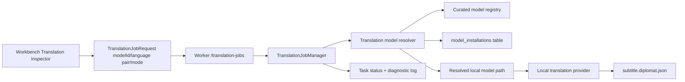

# Diplomat 0.25 Local Translation

Checkpoint date: 2026-06-14

## Goal

Diplomat 0.25 makes offline Chinese-English translation a formal desktop workflow. Users should select an installed curated translation model, translate a saved subtitle document without configuring a remote endpoint, preserve manually edited translations by default, and receive clear task progress, retry, cancel, and diagnostics.

This stage keeps deterministic fake translation and LibreTranslate only for tests and explicit development wiring. The formal 0.3 UI must not require or promote a remote translation service.

## Product Decisions

- The formal translation path is driven by a curated `modelId` installed by the 0.23 model manager.
- The light tier uses `ct2-marian` entries:
  - `translation.opus-mt.zh-en`
  - `translation.opus-mt.en-zh`
- The high-quality tier uses `local-llm`:
  - `translation.qwen3.4b`
- Chinese-to-English and English-to-Chinese are the hard acceptance language pairs.
- The Worker validates task type, runtime, provider, language pair, install state, installed path safety, model files, device, and compute type before using a local model.
- `missing_only` remains the default mode and protects manually edited translations.
- `overwrite_all` is the explicit user action that can replace edited translations.
- Translation settings persist the selected `modelId`, provider, source language, target language, mode, device, and compute type.
- Final production model package URLs, pinned checksums, tokenizer file manifests, and license audit remain mandatory before 0.30 acceptance.

## Scope

### Included

- Shared `TranslationJobRequest` support for:
  - `modelId`
  - `modelNameOrPath`
  - `device`
  - `computeType`
  - providers `fake`, `libretranslate`, `ct2-marian`, and `local-llm`
- Worker translation model resolver that binds `modelId` to an installed curated translation model directory.
- Worker compatibility checks for:
  - model exists in curated registry.
  - model task is `translation`.
  - runtime/provider match `ct2-marian` or `local-llm`.
  - requested language pair is supported.
  - install state is `installed`.
  - installed path exists and is app-owned.
  - runtime options are supported.
- Local translation providers:
  - `CTranslate2MarianProvider`, using lazy `ctranslate2` and `sentencepiece` imports.
  - `LocalLlmTranslationProvider`, using lazy `transformers` and `torch` imports.
- Translation job integration:
  - create-time validation when a formal local model is selected.
  - run-time revalidation before model loading.
  - stable error codes and diagnostic logs on local-model failures.
  - cancel and retry behavior preserved.
- Project store migration for `translation_settings.model_id`, `model_name_or_path`, `device`, and `compute_type`.
- Web Workbench Translation inspector:
  - installed curated translation model selector.
  - formal UI hides Provider, Endpoint, and API key env.
  - language pair validation against selected model.
  - start blocked until an installed compatible model is selected.
  - device and compute controls for GPU-first and CPU fallback behavior.
  - development controls remain available only through an explicit prop.

### Excluded

- Timeline, waveform, split/merge, undo/redo, autosave, and snapshot recovery. Those land in 0.26 and 0.27.
- VTT/ASS export and subtitle visual style editor. Those land in 0.28.
- Burned-in video export. That lands in 0.29.
- Windows installer, final model package audit, and full 0.3 manual acceptance. Those land in 0.30.
- Adding non Chinese-English formal language pairs.
- Bundling model weights in the repository or standard installer.

## Architecture



### Shared Contract

`TranslationJobRequest` gains:

- `modelId: string | null`
- `modelNameOrPath: string | null`
- `device: string`
- `computeType: string`

Provider semantics:

- `provider: "ct2-marian"` with `modelId` is the formal light-tier local model path.
- `provider: "local-llm"` with `modelId` is the formal high-quality local model path.
- `provider: "fake"` remains deterministic test/demo behavior.
- `provider: "libretranslate"` remains a development-only remote path and is hidden from the formal UI.
- `modelNameOrPath` is a development escape hatch and must not appear in the formal Workbench UI.

### Worker Model Resolution

The Worker adds a focused translation resolver that receives:

- `TranslationProviderConfig`.
- project source and target language defaults.
- `ProjectStore`.
- curated model registry.
- optional unmanaged-model allowance used only by explicit development wiring.

Resolution rules:

- `fake` returns unchanged after language fallback.
- `libretranslate` remains endpoint-driven and skips local model resolution.
- `ct2-marian` and `local-llm` require `modelId` unless explicit unmanaged development models are allowed.
- The entry must exist in the bundled registry.
- The entry must have task `translation`.
- The entry runtime/provider must match the selected local provider.
- The requested language pair must be listed in `entry.language_pairs`.
- Install state must be `installed`.
- `installedPath` must exist and remain inside the app-owned models root.
- CPU accepts `int8` and `float32`.
- CUDA accepts `int8`, `float16`, and `float32`.

Expected stable error codes:

- `TRANSLATION_MODEL_REQUIRED`
- `TRANSLATION_MODEL_NOT_FOUND`
- `TRANSLATION_MODEL_NOT_COMPATIBLE`
- `TRANSLATION_LANGUAGE_PAIR_UNSUPPORTED`
- `TRANSLATION_MODEL_NOT_INSTALLED`
- `TRANSLATION_MODEL_FILES_MISSING`
- `TRANSLATION_DEVICE_UNSUPPORTED`
- `TRANSLATION_COMPUTE_UNSUPPORTED`
- `TRANSLATION_RUNTIME_UNAVAILABLE`
- `TRANSLATION_FAILED`

### Local Runtime Providers

`CTranslate2MarianProvider` expects an installed model directory that contains a CTranslate2 model and SentencePiece tokenizer files. The provider imports `ctranslate2` and `sentencepiece` lazily, encodes source text with the source tokenizer, runs `Translator.translate_batch`, and decodes the best hypothesis with the target tokenizer.

`LocalLlmTranslationProvider` expects an installed local causal language model directory and imports `transformers` and `torch` lazily. It prompts the model to return only the translated subtitle text for the requested language pair, then strips prompt echo and surrounding whitespace from the decoded response.

Both providers must:

- check cancellation before loading and before each inference call.
- return `TranslationResult.provider` and `TranslationResult.model` using stable local identifiers.
- raise clear runtime errors when optional dependencies are missing.
- avoid any network request.

### Worker Task Behavior

Creation-time validation catches missing, unavailable, wrong-language, and unsafe model choices before queueing where possible. Start-time validation runs again to catch races such as deleting a model after the job is queued.

Task request payload stores the curated request:

- provider.
- model id.
- source language.
- target language.
- mode.
- device.
- compute type.

It does not store the resolved absolute installed path as the stable identity.

`missing_only` selects source lines with source text and no usable translated text, or failed/not-requested translation state. Lines marked `edited` with non-empty translated text are not selected. `overwrite_all` selects every source line with text and can replace edited translations.

### Web UI

The formal Workbench Translation inspector should:

- show installed usable translation models from the catalog.
- store the selected model id in the translation config.
- set provider from the selected model's provider.
- set or validate the language pair against the selected model's `languagePairs`.
- show the selected model's availability reason when unavailable.
- show a clear no-model message when no usable translation model is installed.
- hide Provider, Endpoint, and API key env fields by default.
- disable Start and Retry until language fields are valid and a compatible installed model is selected.
- expose fake/LibreTranslate controls only when `allowDevelopmentControls` is true.

## Testing Requirements

### Shared Tests

- `TranslationJobRequestSchema` parses local model fields.
- Local translation providers serialize `modelId`, device, and compute type.
- Defaults remain backward compatible for legacy/fake test calls.

### Worker Tests

- Translation resolver rejects missing local `modelId`.
- Resolver rejects unknown model ids.
- Resolver rejects ASR models for translation.
- Resolver rejects wrong local provider/runtime combinations.
- Resolver rejects unsupported language pairs.
- Resolver rejects uninstalled models.
- Resolver rejects missing installed files.
- Resolver returns an installed model path for a curated translation model.
- Resolver rejects CPU/float16 and accepts CUDA/float16.
- CTranslate2 provider converts mocked tokenizer and translator results.
- CTranslate2 provider reports missing optional dependencies.
- Local LLM provider calls mocked tokenizer/model generation and extracts translated text.
- Local LLM provider reports missing optional dependencies.
- Translation jobs complete through an injected local provider with an installed curated model.
- Translation jobs fail with stable diagnostics if a queued model disappears before execution.
- `missing_only` protects edited translations.
- `overwrite_all` replaces edited translations.
- Retry preserves or replaces local model configuration as requested.
- Translation settings persist `modelId`, device, and compute type across store recreation.
- Old translation settings tables migrate without data loss.

### Web Tests

- Translation inspector lists installed compatible translation models by name.
- Selecting a model sets provider, `modelId`, and compatible language pair.
- Start is disabled when no installed usable translation model exists.
- Start is disabled when selected model does not support the requested language pair.
- Provider, Endpoint, and API key env are hidden in the formal UI.
- Development controls can still edit fake/LibreTranslate fields when explicitly enabled.
- Workbench posts `modelId`, provider, language pair, mode, device, and compute type.
- Retry posts the current curated translation config.
- English and Chinese strings cover no-model, install-model, and incompatible-pair copy.

### Manual Verification

1. Start Worker and Web app.
2. Open a project with a saved subtitle document containing Chinese source text and empty English translations.
3. Confirm the Translation inspector prompts for an installed translation model if none is installed.
4. Install or seed a valid curated translation model directory in the model manager state.
5. Select `translation.opus-mt.zh-en`, choose `missing_only`, and start translation.
6. Confirm task progress reaches completed or fails with actionable diagnostics.
7. Confirm translated text appears in the Workbench and survives save/reopen.
8. Mark one translated line as edited, rerun `missing_only`, and confirm it is not overwritten.
9. Choose `overwrite_all`, rerun translation, and confirm the edited line is replaced only after the explicit mode choice.
10. Repeat the flow for English-to-Chinese with `translation.opus-mt.en-zh` or a compatible high-quality local model.

## Focused Verification Commands

```powershell
corepack pnpm --dir packages/shared test
python -m pytest worker/tests/translation worker/tests/tasks/test_translation_jobs.py worker/tests/api/test_app.py worker/tests/storage/test_project_store.py -q
corepack pnpm --dir apps/web exec vitest run src/components/inspectors/TranslationInspector.test.tsx src/pages/WorkbenchPage.test.tsx tests/api.test.ts
corepack pnpm --dir apps/web typecheck
```

## Full Verification

```powershell
.\scripts\check.ps1
```

## Acceptance Criteria

0.25 is complete when:

- Formal Workbench translation jobs are configured by installed curated translation `modelId`.
- The Worker refuses unavailable, incomplete, wrong-task, wrong-provider, wrong-language-pair, or unsafe translation model selections.
- A CTranslate2 Marian provider can run against a resolved installed local model path with mocked runtime coverage.
- A local-LLM provider can run against a resolved installed local model path with mocked runtime coverage.
- Translation task state remains accurate through queued, running, completed, failed, canceled, and retried states.
- Failed local translation jobs leave diagnostic logs and stable error codes where applicable.
- `missing_only` protects non-empty edited translations.
- `overwrite_all` explicitly replaces existing translations.
- Bilingual save/reopen/export remains compatible with generated translation metadata.
- Remote translation fields are hidden from the formal UI.
- Fake and LibreTranslate remain available for deterministic tests and explicit development use.
- Focused tests pass.
- Full repository verification passes.
- A 0.25 stage gate review records verification evidence, manual translation smoke status, and remaining model package limitations.

## Known Risks

- Real CTranslate2 and local-LLM performance depends on GPU, model size, tokenizer packaging, and native dependency versions.
- OPUS-MT CTranslate2 model packages must include the expected tokenizer files before manual acceptance can pass.
- High-quality local LLM translation can be slow or memory-heavy on CPU; GPU is the recommended path.
- The built-in registry still needs final production model artifact URLs, checksums, and license review before 0.30.
- Very long subtitle documents may need batching and richer progress estimates in a later hardening pass.
