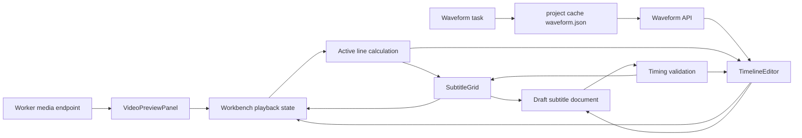

# Diplomat 0.26 Professional Editing Core

Checkpoint date: 2026-06-14

## Goal

Diplomat 0.26 turns the Workbench from a form-based review surface into a usable subtitle timing editor. Users should be able to play the project video, seek from subtitle rows and timeline blocks, see the active subtitle during playback, inspect waveform peaks, zoom the timeline, drag or resize subtitle blocks, and see timing problems before save or export.

This stage deliberately stops short of the workflow polish planned for 0.27: keyboard shortcuts, split/merge, undo/redo, autosave, recovery snapshots, and batch timing tools remain out of scope.

## Product Decisions

- The editor remains a dense desktop work surface, not a marketing or card-heavy layout.
- The existing light application shell stays intact. Video and timeline zones use darker media-editor surfaces only where they improve contrast.
- Local video preview is served through the Worker project media endpoint instead of relying on browser access to raw Windows paths.
- Playback state is owned by the Workbench and shared with video preview, subtitle grid, and timeline.
- Waveform generation is a Worker task so it can report progress, failures, retry/cancel state, and diagnostics through the existing task model.
- Waveform data is cached under the project cache directory and can be refetched without rerunning ASR or translation.
- Timing edits update the in-memory draft document first. Users still use the existing explicit Save action to persist stable subtitle state.
- Drag and resize operations snap to a small step for predictable editing, while preserving exact millisecond state internally.
- Invalid timing is visible in the UI before save/export. 0.26 warns but does not yet introduce the 0.27 stable-save/export-protection model.

## Scope

### Included

- Worker source media endpoint:
  - `GET /projects/{project_id}/media/source`
  - returns the project source video from its stored path.
  - rejects missing projects and missing source media with clear HTTP errors.
- Shared waveform contract:
  - waveform peak schema.
  - waveform response schema.
  - `waveform` task type.
- Worker waveform generation:
  - FFmpeg preflight through the existing runtime tool checks.
  - raw mono audio extraction to in-memory samples.
  - peak aggregation into a compact JSON cache.
  - waveform task creation, progress, failure, cancel, retry, and diagnostics.
  - waveform data endpoint:
    - `GET /projects/{project_id}/waveform`
    - returns cached waveform or `404` when it has not been generated.
  - waveform job endpoint:
    - `POST /projects/{project_id}/waveform-jobs`
- Web API and query hooks for media URL, waveform data, and waveform jobs.
- Video preview improvements:
  - Worker media URL source.
  - current playback time updates.
  - seek requests from subtitle row and timeline selection.
  - selected subtitle overlay remains visible.
- Subtitle grid improvements:
  - row click seeks to subtitle start.
  - active line highlight during playback.
  - timing issue badges on rows.
- Timing validation:
  - negative start/end.
  - end before or equal to start.
  - duration shorter than the minimum readable threshold.
  - overlapping neighboring lines.
  - likely overlong text for the line duration.
- Timeline editor:
  - waveform peak rendering.
  - playhead.
  - selected range.
  - zoom control.
  - horizontal scrolling.
  - subtitle blocks.
  - drag block to move start/end together.
  - resize block left/right edges to adjust timing.
  - accessible controls and ARIA labels for key operations.
- Browser smoke covering the real Workbench interaction path.

### Excluded

- Keyboard shortcut registry and shortcut help panel.
- Split subtitle at cursor/playhead.
- Merge previous/next.
- Batch offset tools.
- Undo/redo stack.
- Autosaved drafts and recovery snapshots.
- VTT/ASS export and style editor.
- Burned-in video export.
- Waveform thumbnails, spectrograms, denoising, or frame-accurate NLE behavior.

## Architecture



### Worker Media Endpoint

The Workbench should not load raw Windows paths directly. The Worker already owns the project record and can safely resolve the source video path. The media endpoint returns a `FileResponse` for the stored path after checking that the project exists and the source file exists.

This keeps desktop and browser development mode aligned:

- Desktop: WebView requests `http://127.0.0.1:8765/projects/{id}/media/source`.
- Browser dev: Vite app requests the same Worker URL.
- Tests: API tests can create a temporary source file and verify the endpoint returns its bytes or a clear 404.

### Waveform Generation

0.26 adds `worker/diplomat_worker/media/waveform.py`.

Expected responsibilities:

- Build a safe FFmpeg command:
  - input source video.
  - no video output.
  - mono audio.
  - fixed sample rate.
  - raw `f32le` PCM to stdout.
- Convert samples into peak buckets.
- Normalize absolute amplitudes to `0..1`.
- Write compact JSON to `project.project_dir / "cache" / "waveform.json"`.

The waveform response contains:

- `projectId`
- `durationMs`
- `sampleRate`
- `peakCount`
- `peaks`, where each peak has:
  - `index`
  - `startMs`
  - `endMs`
  - `min`
  - `max`

The first implementation targets stable visual guidance, not audio analysis precision. A compact peak count around 512 to 2048 is acceptable for 0.26.

### Waveform Task

0.26 adds a `WaveformJobManager` modeled after the existing analysis and translation managers.

Behavior:

- `create_waveform_job(project_id)` creates a `waveform` task.
- queued jobs can be canceled.
- running jobs can be marked canceling, with cancellation checked before and after generation.
- failures write a diagnostic log under the project log directory.
- retry starts a fresh waveform job.
- completed jobs touch project state and leave the cached waveform JSON available through the waveform endpoint.

### Timing Validation

Frontend validation runs on every draft document change and returns issues keyed by line id.

Issue codes:

- `negative_time`
- `end_before_start`
- `too_short`
- `overlap_previous`
- `overlap_next`
- `overlong_text`

Validation should not mutate lines. It only produces display data and disables no controls in 0.26. The stricter export gate lands in 0.28.

### Timeline Editing

The Timeline Editor receives the draft lines and emits updated lines:

- Drag block body: move start and end by the same delta.
- Drag left edge: adjust start, clamped below end.
- Drag right edge: adjust end, clamped above start.
- Click block: select line and seek to line start.
- Click waveform/timeline background: seek to clicked time.

Constraints:

- Time never goes below `0`.
- End never exceeds document/project duration.
- Minimum duration defaults to `300ms`.
- Snap step defaults to `50ms`.
- Horizontal layout uses a stable pixels-per-millisecond scale derived from zoom.
- Blocks remain stable in height and cannot resize the surrounding layout.

### Workbench Integration

Workbench owns:

- `currentTimeMs`
- `seekRequest`
- `activeLineId`
- waveform query state.
- waveform task state.

The selected line remains user-controlled. Active line during playback is visually distinct from selected line:

- selected: editing focus.
- active: current playback line.
- selected and active: combined highlight.

## UI Direction

The UI/UX reference search recommended a video-first, dark media-editor treatment. For Diplomat this is adapted conservatively:

- Keep the existing light shell and restrained teal/gray operational palette.
- Use dark backgrounds for video and waveform only.
- Use teal for selected/editing focus and amber/red for validation warnings.
- Keep panels dense and scannable.
- Avoid decorative gradients, oversized hero surfaces, and nested card structures.
- Maintain visible focus states and labels for timeline controls.

## Testing Requirements

### Shared Tests

- `TaskTypeSchema` accepts `waveform`.
- `WaveformPeakSchema` validates normalized peaks.
- `WaveformResponseSchema` rejects out-of-range peak values.

### Worker Tests

- Waveform peak aggregation returns stable buckets for deterministic samples.
- Empty audio returns an empty or zeroed waveform response without crashing.
- Waveform cache write/read round-trips.
- Waveform job creates a queued `waveform` task.
- Waveform job completes and writes cached waveform JSON through an injected generator.
- Waveform job fails with diagnostic logs when FFmpeg preflight fails.
- Canceling a queued waveform job marks it canceled.
- Retrying a failed/canceled waveform task creates a new task.
- API media endpoint returns source bytes.
- API media endpoint returns 404 for missing source media.
- API waveform endpoint returns 404 before generation and data after cache is written.
- API waveform job endpoint returns a task response.
- Task cancel/retry supports `waveform`.

### Web Tests

- API client parses waveform responses and posts waveform jobs.
- Workbench uses Worker media URL instead of raw source path for the video element.
- Video time updates active line highlighting.
- Clicking a subtitle row selects the row and requests a seek to the line start.
- Timing validation flags negative, overlapping, too-short, and overlong lines.
- Timeline renders waveform peaks and subtitle blocks.
- Timeline click requests seek.
- Dragging a block updates start/end by the expected snapped delta.
- Resizing block edges updates only the relevant timing edge.
- Validation badges appear in the grid and timeline.

### Manual Verification

1. Start Worker and Web app.
2. Open a project with a source video and subtitle document.
3. Confirm the video element loads from the Worker media URL.
4. Start waveform generation if no cached waveform exists.
5. Confirm task progress reaches completed or fails with an actionable diagnostic.
6. Confirm waveform peaks render below the subtitle grid.
7. Play or scrub the video and confirm the playhead updates.
8. Click a subtitle row and confirm the video seeks to that row's start time.
9. Drag a subtitle block and confirm the row timing updates as draft state.
10. Resize both block edges and confirm start/end values update without corrupting order.
11. Create an overlap and confirm validation appears before saving.

## Focused Verification Commands

```powershell
corepack pnpm --dir packages/shared test
python -m pytest worker/tests/media/test_waveform.py worker/tests/tasks/test_waveform_jobs.py worker/tests/api/test_app.py -q
corepack pnpm --dir apps/web exec vitest run tests/api.test.ts src/lib/timingValidation.test.ts src/components/TimelineEditor.test.tsx src/components/SubtitleGrid.test.tsx src/components/VideoPreviewPanel.test.tsx src/pages/WorkbenchPage.test.tsx
corepack pnpm --dir apps/web typecheck
```

## Full Verification

```powershell
.\scripts\check.ps1
```

## Acceptance Criteria

0.26 is complete when:

- Workbench video preview uses a Worker media URL and exposes playback time to the editor.
- Subtitle row selection can seek playback to the row start.
- Active subtitle line highlighting follows playback time.
- Worker can create, complete, cancel, fail, retry, and diagnose waveform tasks.
- Cached waveform data is available through an API endpoint.
- Timeline renders waveform peaks, playhead, selected range, and subtitle blocks.
- Users can drag and resize subtitle blocks to update draft timing.
- Timing validation issues are visible before save/export.
- Focused tests pass.
- Full repository verification passes.
- Browser smoke verifies the editor interaction path.
- A 0.26 stage gate review records verification evidence and remaining limitations.

## Known Risks

- Browser-based smoke can verify the Worker media URL and DOM state, but real video playback depends on valid media codecs available in the local browser/WebView.
- FFmpeg waveform extraction can be slow on long media; 0.26 uses compact peaks and a cache but does not yet implement waveform chunking.
- Pointer-event drag tests cover deterministic deltas; they do not prove professional feel on every input device.
- The 0.27 undo/redo and snapshot system is still needed before risky bulk edits are safe for daily production use.
