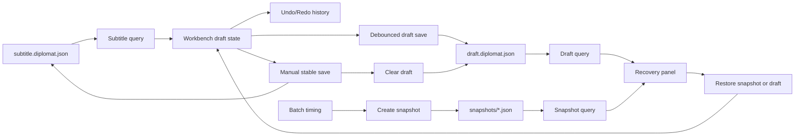

# Diplomat 0.27 Editing Workflow Polish

Checkpoint date: 2026-06-14

## Goal

Diplomat 0.27 completes the daily editing loop around the 0.26 professional timeline. Users should be able to make repeated subtitle edits with keyboard shortcuts, undo/redo, split/merge, batch timing tools, autosaved drafts, stable saves, and recoverable snapshots.

0.27 is not an export-format milestone. SRT/VTT/ASS hardening and subtitle style work remain 0.28. Burned-in video rendering remains 0.29.

## Product Decisions

- `subtitle.diplomat.json` remains the stable saved subtitle document.
- `draft.diplomat.json` becomes the autosaved working document.
- Stable save persists the current draft to `subtitle.diplomat.json` and clears `draft.diplomat.json`.
- Export remains based on the stable saved subtitle document only.
- A server-side draft blocks export until the user restores and saves it, or discards it.
- Snapshots are explicit recoverable versions stored under `snapshots/`.
- Snapshot creation is automatic before risky overwrite operations and explicit before batch timing edits.
- Undo/redo is a Workbench editing history for the current session. Autosaved drafts and snapshots are the cross-session recovery layer.
- Shortcuts must not mutate subtitles while focus is inside text fields, number fields, selects, buttons, or content-editable regions.
- Split uses the selected line and the current playhead when the playhead is inside that line. If the playhead is outside the selected line, the line midpoint is used.
- Merge previous/next combines timing, source text, translated text, words, notes, and status conservatively into the surviving line.
- Batch offset supports selected line, all lines, or lines after the current playhead.

## Scope

### Included

- Shared draft and snapshot response schemas.
- Worker draft persistence:
  - `GET /projects/{project_id}/subtitle/draft`
  - `PUT /projects/{project_id}/subtitle/draft`
  - `DELETE /projects/{project_id}/subtitle/draft`
- Worker subtitle snapshots:
  - `GET /projects/{project_id}/subtitle/snapshots`
  - `POST /projects/{project_id}/subtitle/snapshots`
  - `POST /projects/{project_id}/subtitle/snapshots/{snapshot_id}/restore`
- Snapshot creation before:
  - analysis job creation when a stable subtitle document already exists.
  - translation job creation with `overwrite_all`.
  - batch timing commands in the Workbench.
- Backup/import preservation of draft and snapshot files.
- Draft-aware project diagnostics using the existing `dirty_draft` status.
- Web API helpers and React Query hooks for drafts and snapshots.
- Pure subtitle editing helpers:
  - split selected line.
  - merge with previous.
  - merge with next.
  - offset selected/all/after-playhead lines.
  - focus-safe shortcut gating.
- Undo/redo stack for text and timing edits performed inside the Workbench.
- Shortcut help panel.
- Editor command bar with undo/redo, split, merge, and batch offset controls.
- Recovery panel for autosaved draft and snapshots.
- Autosave of draft state after local edits.
- Stable Save flow that persists the draft and clears server draft state.
- Export blocking when local draft or server draft recovery is pending.
- Browser smoke covering keyboard, recovery, autosave, and batch timing paths.

### Excluded

- Rich text cursor based split inside subtitle text.
- Multi-select row editing.
- Full command palette.
- Collaboration or cloud sync.
- Export format/style work.
- Burned-in export preparation beyond snapshot reason support.
- Persistent undo history across restarts.

## Architecture



### Worker Drafts

Drafts are project-local subtitle documents stored as:

```text
<project_dir>/draft.diplomat.json
```

Draft methods validate `document.project_id` against the project id. Draft save touches the project so Project Center can show `dirty_draft`. Stable subtitle save deletes the draft because the user's current working copy has become the stable version.

Draft response:

- `projectId`
- `updatedAt`
- `lineCount`
- `document`

### Worker Snapshots

Snapshots are project-local JSON files stored as:

```text
<project_dir>/snapshots/<snapshot_id>.diplomat-snapshot.json
```

Each snapshot file contains metadata plus the subtitle document:

- `schemaVersion`: `diplomat.subtitle-snapshot.v1`
- `snapshotId`
- `projectId`
- `reason`
- `label`
- `createdAt`
- `lineCount`
- `document`

Allowed snapshot reasons:

- `manual`
- `analysis_overwrite`
- `translation_overwrite`
- `batch_timing`
- `burn_in_export_preparation`
- `restore`

`POST /subtitle/snapshots` accepts a reason, optional label, and optional document. When no document is supplied, the Worker snapshots the current stable subtitle document. When a document is supplied, the Worker validates it and snapshots that exact working state.

Restore writes the snapshot document as the stable subtitle document and clears any autosaved draft. This is intentionally explicit because it changes the stable saved state.

### Backup And Import

Project backup includes:

- `subtitle.diplomat.json`
- `draft.diplomat.json` when present.
- `snapshots/*.diplomat-snapshot.json`
- translation settings.
- exports.

Import rewrites `projectId` inside subtitle, draft, and snapshot documents to the newly created project id.

### Editing History

Workbench keeps an in-memory history:

- past states.
- present subtitle document.
- future states.

Every committed edit pushes the previous document into `past` and clears `future`. Undo moves present into `future`; redo moves from `future` back to present. Remote refetches do not overwrite a local draft.

### Autosave

Autosave starts only after a user edit creates a draft. It does not write the initial loaded stable document. It uses a short debounce so continuous timeline edits do not issue one request per pointer event.

Autosave errors stay visible in the Workbench, but they do not delete the local draft. Manual Save remains available.

### Keyboard Shortcuts

0.27 shortcuts:

| Shortcut | Command |
| --- | --- |
| `Ctrl+Z` | Undo |
| `Ctrl+Y` / `Ctrl+Shift+Z` | Redo |
| `Ctrl+S` | Stable save |
| `?` | Shortcut help |
| `S` | Split selected line |
| `Alt+[` | Merge with previous |
| `Alt+]` | Merge with next |
| `Alt+Left` | Offset selected line backward |
| `Alt+Right` | Offset selected line forward |

Shortcut commands are ignored when focus is inside editable controls.

## UI Direction

- Keep the Workbench dense and desktop-like.
- Add a compact editor command bar between task status and media body.
- Use icon buttons with tooltips for undo, redo, split, merge, and help.
- Use a compact numeric offset input and segmented scope controls for batch timing.
- Show recovery as a narrow operational panel, not a modal by default.
- Use the help dialog only for the shortcut reference.
- Keep autosave/stable-save state visible without adding noise to the timeline.

## Testing Requirements

### Shared Tests

- Draft response schema parses a subtitle document.
- Snapshot create request accepts all allowed reasons.
- Snapshot list response parses multiple snapshots.

### Worker Tests

- Draft save/load/delete round-trips.
- Stable subtitle save deletes the draft.
- Project diagnostics returns `dirty_draft` when a draft exists.
- Snapshot create/list/restore round-trips.
- Snapshot restore clears draft.
- Backup/import preserves draft and snapshots while rewriting project ids.
- API exposes draft and snapshot routes.
- API draft endpoints return 404 for missing draft/project.
- API snapshot restore returns 404 for missing snapshot.
- Analysis job creation snapshots an existing stable subtitle document.
- Translation `overwrite_all` job creation snapshots an existing stable subtitle document.

### Web Tests

- API helpers parse draft and snapshot responses.
- Query hooks invalidate project/subtitle/draft/snapshot data after mutations.
- Subtitle editing helpers split, merge, and offset lines deterministically.
- Shortcut gating ignores editable targets.
- Command bar renders expected commands and disables unavailable actions.
- Recovery panel shows autosaved draft and snapshots.
- Workbench restores a server draft into local draft state.
- Workbench autosaves local edits to `/subtitle/draft`.
- Workbench stable Save clears draft through the stable save path.
- Workbench undo/redo works for text and timing edits.
- Workbench split/merge commands update the draft and selection.
- Workbench batch offset creates a snapshot and updates selected/all/after-playhead lines.
- Workbench blocks export when a recoverable server draft is pending.
- Shortcuts do not fire inside source/translation textareas.

## Manual Verification

1. Start Worker and Web app.
2. Open a project with a stable subtitle document.
3. Edit source text and confirm Save enables.
4. Wait for autosave and confirm Worker stores `draft.diplomat.json`.
5. Reload/reopen the project and confirm the recovery panel offers the draft.
6. Restore the draft and confirm edited text returns.
7. Undo and redo the edit.
8. Use `S` to split a selected line while focus is not inside a field.
9. Focus a textarea and press `S`; confirm no split occurs.
10. Merge the split line with previous/next.
11. Apply batch offset to selected/all/after-playhead and confirm a snapshot is created.
12. Restore a snapshot and confirm stable subtitle content changes.
13. Confirm Export is disabled while a local or server draft is pending.

## Focused Verification Commands

```powershell
corepack pnpm --dir packages/shared test
python -m pytest worker/tests/storage/test_project_store.py worker/tests/api/test_app.py worker/tests/tasks/test_analysis_jobs.py worker/tests/tasks/test_translation_jobs.py -q
corepack pnpm --dir apps/web exec vitest run tests/api.test.ts src/lib/subtitleEditing.test.ts src/components/EditorCommandBar.test.tsx src/components/RecoveryPanel.test.tsx src/pages/WorkbenchPage.test.tsx
corepack pnpm --dir apps/web typecheck
```

## Full Verification

```powershell
.\scripts\check.ps1
```

## Acceptance Criteria

0.27 is complete when:

- Draft and snapshot APIs exist and are covered by Worker tests.
- Autosaved drafts persist across reload and can be restored or discarded from the Workbench.
- Stable Save persists the draft and clears the autosaved draft.
- Undo/redo covers text and timing edits in the current session.
- Split, merge previous/next, and batch offset commands work from UI controls.
- Keyboard shortcuts trigger editor commands outside editable fields and do not trigger inside editable fields.
- Risky overwrite and batch timing operations create recoverable snapshots.
- Export is protected from local or recoverable draft state.
- Focused verification passes.
- Full repository verification passes.
- Browser smoke verifies the daily editing workflow.
- A 0.27 stage gate review records verification evidence and remaining limitations.

## Known Risks

- Autosave can make many small writes during intensive editing; debounce and draft replacement keep this acceptable for 0.27.
- Undo/redo is session-only. Cross-session recovery depends on autosaved draft and snapshots.
- Split text heuristics are intentionally simple and may not produce perfect linguistic splits.
- Snapshot growth is unmanaged in 0.27. Cleanup and retention policies can be revisited after the release candidate if real usage shows disk growth.
