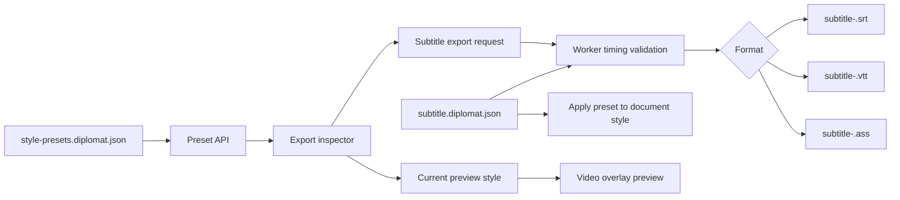

# Diplomat 0.28 Subtitle Export And Visual Styles

Checkpoint date: 2026-06-14

## Goal

Diplomat 0.28 completes professional text subtitle delivery. Users should be able to export stable saved subtitles as SRT, WebVTT, or ASS; choose source, target, or bilingual text output; configure subtitle appearance; preview that appearance over the video; and manage reusable style presets inside the project.

0.28 is a text subtitle and style milestone. Burned-in video rendering remains 0.29, but 0.28 must produce reliable ASS files and style settings that 0.29 can reuse as its subtitle input.

## Product Decisions

- Export continues to use only the stable saved `subtitle.diplomat.json` document.
- Local autosaved drafts and unresolved server drafts continue to block export.
- The existing `/projects/{project_id}/exports/srt` route stays available for backward compatibility.
- A new general subtitle export route handles SRT, VTT, and ASS.
- SRT and VTT ignore visual styling except for text order and timing.
- ASS export uses the selected style preset and is the source of truth for styled text subtitle output.
- Project style presets are stored inside the project directory, not in global settings.
- Every project gets a default preset derived from the subtitle document default style when no preset file exists.
- Saving a style preset is explicit; changing editor controls changes the current preview draft but does not silently create presets.
- Applying a preset updates the first document style so reopened projects and preview agree.
- Export validation runs on the Worker before writing files and in the Web Workbench before enabling export.
- Timing errors block export. Timing warnings are visible and can be exported.
- Bilingual export preserves source and target text order according to the selected bilingual layout.
- Safe-area overlay is preview-only in 0.28 and does not write metadata to SRT/VTT/ASS.

## Scope

### Included

- Shared export schemas:
  - `SubtitleExportFormat`: `srt`, `vtt`, `ass`.
  - `SubtitleExportMode`: `source`, `target`, `bilingual`.
  - export validation issues and warnings.
  - style preset request/response schemas.
- Shared subtitle style schema extensions for:
  - background bar toggle.
  - background color.
  - safe area margin.
- Worker text subtitle export engine:
  - hardened SRT.
  - WebVTT.
  - ASS script generation.
  - source/target/bilingual rendering.
  - server-side timing validation.
  - export warning response payloads.
- Worker style preset persistence:
  - list presets.
  - create preset.
  - rename preset.
  - update preset settings.
  - delete preset.
  - apply preset to stable subtitle document.
- Web API helpers and React Query hooks for text exports and style presets.
- Export inspector format and mode selection.
- User-visible timing validation summary inside the export inspector.
- Visual style editor:
  - font family.
  - font size.
  - primary and secondary colors.
  - outline width.
  - shadow.
  - background bar.
  - alignment.
  - vertical margin.
  - line spacing.
  - bilingual layout.
  - safe-area overlay toggle.
- Live video preview that uses the active style draft.
- Style preset save, select/apply, rename, update, and delete controls.
- Browser smoke covering VTT/ASS export, validation blocking, preview styling, and preset round-trip.

### Excluded

- Burned-in video rendering.
- FFmpeg render jobs.
- Per-speaker style routing beyond using the first/default subtitle style.
- Per-line rich styling controls.
- Subtitle font discovery from the operating system.
- Custom output file picker.
- Karaoke effects.
- Multi-track subtitle output.
- Global style library shared across projects.

## Architecture



### Export Route

New route:

```text
POST /projects/{project_id}/exports/subtitles
```

Request:

- `format`: `srt`, `vtt`, or `ass`.
- `mode`: `source`, `target`, or `bilingual`.
- `stylePresetId`: optional preset id for ASS export.
- `style`: optional inline style override for preview/export parity.

Response:

- `projectId`
- `exportPath`
- `format`
- `mode`
- `warnings`

Compatibility route:

```text
POST /projects/{project_id}/exports/srt
```

This route delegates to the same export engine with `format = "srt"` and keeps its existing response shape.

### Text Rendering

Rendering rules are shared across SRT, VTT, and ASS:

- `source`: source text only.
- `target`: translated text when present, otherwise source text.
- `bilingual`: both lines when translation is present and differs from source; otherwise source text.
- Bilingual `source_top` puts source above target.
- Bilingual `target_top` puts target above source.
- Empty rendered cues are skipped.
- Exported cues are sorted by start time, end time, then line id.

### Timing Validation

Worker export validation blocks these errors:

- negative start or end time.
- end time less than or equal to start time.
- overlapping cues after sorting.

Worker export validation returns warnings for:

- cue shorter than 300ms.
- likely overlong text above 18 characters per second.

The Web Workbench mirrors the same thresholds for immediate user feedback. The Worker remains authoritative.

### Style Presets

Preset file:

```text
<project_dir>/style-presets.diplomat.json
```

File payload:

- `schemaVersion`: `diplomat.style-presets.v1`
- `projectId`
- `activePresetId`
- `presets`

Preset:

- `id`
- `name`
- `style`
- `createdAt`
- `updatedAt`

Default preset behavior:

- If no preset file exists, the Worker returns one default preset based on `document.styles[0]`.
- If the project has no style in its subtitle document, the Worker returns the same pipeline default style used by generated documents.
- Applying a preset writes that style to `document.styles[0]` and updates `activePresetId`.
- Deleting the active preset switches back to the first remaining preset or the generated default preset.

### ASS Output

ASS export writes:

- `[Script Info]`
- `[V4+ Styles]`
- `[Events]`

The generated default style maps:

- font family to `Fontname`.
- font size to `Fontsize`.
- primary color to `PrimaryColour`.
- secondary color to `SecondaryColour`.
- outline width to `Outline`.
- shadow to `Shadow`.
- vertical margin to `MarginV`.
- alignment to ASS numeric alignment.
- line spacing and background bar to inline override tags where needed.

ASS color conversion uses `&HAABBGGRR` with alpha `00` for visible colors.

## UI Direction

- Keep the Export inspector dense and task-focused.
- Use a format segmented control or select above export mode.
- Keep validation messages visible near the export action.
- Style controls live in the export inspector because this is where users decide output.
- Use compact inputs and color swatches rather than explanatory cards.
- Add safe-area overlay to the video preview when the export inspector is active or the user toggles it.
- The live preview should update immediately as style fields change.
- Preset management should feel like a normal desktop preference panel: select, rename, save/update, duplicate-like save, delete.
- Do not show feature education text inside the UI.

## Testing Requirements

### Shared Tests

- Export schemas parse SRT, VTT, and ASS requests.
- Export response schemas parse warnings.
- Style preset schemas parse list/create/update/apply responses.
- Subtitle style schema accepts background bar fields while preserving existing required fields.

### Worker Tests

- SRT export keeps existing behavior and skips empty cues.
- VTT export writes `WEBVTT`, dot milliseconds, sorted cues, and bilingual text.
- ASS export writes script sections, style row, dialogue rows, color conversion, and bilingual text.
- Export validation blocks overlaps and end-before-start with HTTP 409.
- Export validation returns warnings for too-short or overlong cues.
- General export route writes expected file extensions and touches the project.
- Legacy SRT route delegates to the new export engine.
- Style preset storage returns a generated default preset for projects with no preset file.
- Preset create/list/update/rename/delete/apply round-trips.
- Applying a preset updates the stable subtitle document style.
- Missing project and missing subtitle document return 404.

### Web Tests

- API helpers post subtitle export request and parse response warnings.
- API helpers list/create/update/delete/apply style presets.
- Query hooks invalidate project/subtitle/style/export data after mutations.
- Export inspector changes format and mode, shows warnings, blocks errors, and calls export.
- Style editor changes font, colors, outline, shadow, background bar, alignment, margins, line spacing, bilingual layout, and safe-area overlay.
- Preset controls select, save, rename, update, delete, and apply presets.
- Video preview renders style draft over the selected line.
- Workbench blocks export for timing errors and unresolved drafts.
- Workbench shows timing warnings while still allowing export.

## Manual Verification

1. Start Worker and Web app.
2. Open a project with saved source and translated subtitle text.
3. Open the Export inspector.
4. Export SRT in bilingual mode and confirm source and target lines are present.
5. Export VTT in target mode and confirm `WEBVTT` and dot timestamps.
6. Export ASS in bilingual mode and confirm `[V4+ Styles]` and `[Events]` sections.
7. Change font size, colors, outline, shadow, background bar, margins, alignment, and line spacing.
8. Confirm the video preview changes immediately.
9. Toggle safe-area overlay and confirm it appears without blocking video controls.
10. Save a style preset, rename it, apply it, update it, and delete it.
11. Reopen the project and confirm remaining presets persist.
12. Create an overlap timing error and confirm export is blocked.
13. Create a short cue warning and confirm export remains available with a warning.
14. Confirm unresolved autosaved drafts still block export.

## Focused Verification Commands

```powershell
corepack pnpm --dir packages/shared test
python -m pytest worker/tests/export/test_text_subtitles.py worker/tests/storage/test_project_store.py worker/tests/api/test_app.py -q
corepack pnpm --dir apps/web exec vitest run tests/api.test.ts src/components/inspectors/ExportInspector.test.tsx src/components/VideoPreviewPanel.test.tsx src/pages/WorkbenchPage.test.tsx
corepack pnpm --dir apps/web typecheck
```

## Full Verification

```powershell
.\scripts\check.ps1
```

## Acceptance Criteria

0.28 is complete when:

- SRT, VTT, and ASS exports are generated from the stable saved subtitle document.
- Source, target, and bilingual modes work consistently across all text formats.
- Existing SRT API behavior remains compatible.
- Worker export validation blocks timing errors before writing files.
- Worker and Web both show timing warnings for risky but exportable subtitle lines.
- Users can create, select/apply, rename, update, and delete project style presets.
- Style changes are visible in the video preview before export.
- ASS export reflects the selected or inline style.
- Export remains blocked while local or server drafts are unresolved.
- Focused verification passes.
- Full repository verification passes.
- Browser smoke verifies the export and style workflow.
- A 0.28 stage gate review records verification evidence and remaining limitations.

## Known Risks

- Font rendering in ASS depends on fonts available on the user's system. 0.28 exposes font family text input but does not validate OS font installation.
- SRT and VTT cannot represent most visual style settings. The UI must make it clear through behavior that visual styling is primarily for ASS and future burn-in export.
- The first/default style model is sufficient for 0.28, but per-speaker styling may require schema expansion after 0.3.
- Web and Worker validation thresholds must stay aligned to avoid confusing enabled/blocked states.
