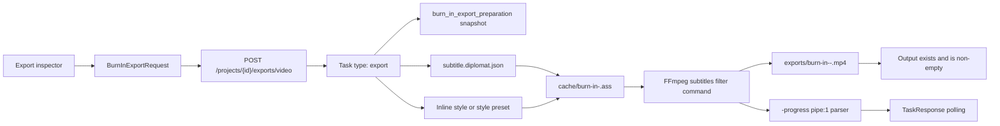

# Diplomat 0.29 Burned-In Video Export

Checkpoint date: 2026-06-14

## Goal

Diplomat 0.29 completes the final output workflow before release hardening. Users should be able to render a new local video file with visible burned-in subtitles, monitor export progress, cancel a running render, retry a failed or canceled render, and find the output in the project exports folder.

0.29 builds directly on 0.28. ASS subtitle generation and visual style presets remain the source of truth for burn-in appearance. The Worker owns rendering, path safety, validation, and diagnostics; the Web Workbench owns starting and monitoring the task through the same task surface used by ASR, translation, and waveform jobs.

## Product Decisions

- Burned-in export uses the stable saved `subtitle.diplomat.json` document.
- Local autosaved drafts and unresolved server drafts continue to block export.
- The request returns a `TaskResponse`, not a completed export response.
- Burn-in render tasks use existing task type `export`.
- Retry starts a fresh render task from the original task request payload.
- Cancel requests should mark queued tasks canceled immediately and request termination for running FFmpeg processes.
- The default output path is inside `<project_dir>/exports`.
- 0.29 Web UI does not require a custom output path picker. The Worker contract supports a future explicit output path, but browser-mode UI sends `null`.
- The Worker refuses to overwrite the source video.
- The Worker refuses output paths outside the project exports directory unless a future desktop bridge explicitly passes and validates an external user-selected path.
- Rendered output defaults to MP4 with H.264 video and copied audio where possible.
- The generated ASS intermediate is stored in the project cache directory and reused only for the active render task.
- 0.28 style presets and inline style drafts are accepted as burn-in style input.
- Output folder access reuses the project-center desktop open exports folder action and is exposed from the Export inspector when an exports directory is known.
- Missing FFmpeg, unsafe paths, invalid subtitles, style/preset lookup failures, FFmpeg failures, canceled renders, and missing output files must leave actionable task diagnostics.

## Scope

### Included

- Shared burn-in export request schema:
  - `mode`: `source`, `target`, or `bilingual`.
  - `stylePresetId`: optional project style preset id.
  - `style`: optional inline subtitle style override.
  - `outputPath`: optional future desktop-selected path.
  - `videoCodec`: default `libx264`.
  - `crf`: default `18`.
  - `preset`: default `medium`.
- Worker burn-in export engine:
  - safe output path resolution.
  - source-overwrite protection.
  - ASS intermediate writing from selected style.
  - FFmpeg subtitles filter path escaping.
  - FFmpeg command construction.
  - FFmpeg progress parsing from `-progress pipe:1`.
  - output validation after render.
- Worker export task manager:
  - create, run, cancel, and retry export tasks.
  - diagnostic logs under project logs.
  - progress and user-facing task messages.
  - subtitle snapshot before burn-in preparation.
- Worker API:
  - `POST /projects/{project_id}/exports/video`.
  - export task dispatch in `/tasks/{task_id}/cancel`.
  - export task dispatch in `/tasks/{task_id}/retry`.
- Web API and React Query helpers for burn-in export.
- Export inspector UI:
  - start burned-in video export.
  - show active export task status.
  - cancel export.
  - retry failed or canceled export.
  - open exports folder when desktop path opening is available.
- Focused worker, shared, web, and e2e coverage.
- Browser smoke with a short generated local video.

### Excluded

- Advanced render queue management with multiple concurrent exports.
- Custom codec profiles beyond a small, validated H.264 MP4 default.
- Bitrate, resolution, hardware encoder, or audio codec UI.
- External output path picker in browser-only mode.
- Font discovery or font embedding.
- Per-speaker style routing.
- Subtitle animations, karaoke effects, and multi-track burn-in.
- Cross-platform packaging changes. Those remain 0.30 release-hardening scope.

## Architecture



### Burn-In Route

New route:

```text
POST /projects/{project_id}/exports/video
```

Request:

- `mode`: `source`, `target`, or `bilingual`.
- `stylePresetId`: optional style preset id.
- `style`: optional inline style override.
- `outputPath`: optional path, normally `null` in 0.29 Web UI.
- `videoCodec`: optional, default `libx264`.
- `crf`: optional integer from 0 to 51, default `18`.
- `preset`: optional FFmpeg preset, default `medium`.

Response:

- `TaskResponse`

The initial response is a queued task. The UI polls `/tasks/{task_id}` and uses the existing cancel and retry task endpoints.

### Output Path Safety

Default output:

```text
<project_dir>/exports/burn-in-<mode>-<task_id>.mp4
```

Rules:

- Resolve source and output paths before comparing.
- Reject output path when it resolves to the source media path.
- Reject output path when it is the project directory or the exports directory itself.
- Reject default or browser-provided output paths outside the project exports directory.
- Create the exports directory before rendering.
- Do not delete or truncate an existing source file.
- Use a task-specific filename to avoid accidental overwrite of prior exports.

### FFmpeg Command

The Worker constructs a list-form subprocess command. It does not shell-concatenate user-controlled paths.

The baseline command shape:

```text
ffmpeg -y -i <source> -vf subtitles=<escaped_ass_path> -c:v libx264 -crf 18 -preset medium -c:a copy -movflags +faststart -progress pipe:1 -nostats <output>
```

The subtitles filter path is escaped for FFmpeg filter syntax, especially Windows drive letters, backslashes, spaces, and single quotes.

### Task Lifecycle

Queued:

- Task exists with `type = "export"`.
- Request payload stores the normalized burn-in request.

Running:

- Preflight FFmpeg and source media.
- Load stable subtitle document.
- Validate subtitle timing.
- Resolve style from inline style, style preset, or document default.
- Create a `burn_in_export_preparation` snapshot.
- Write ASS intermediate.
- Spawn FFmpeg.
- Parse progress output and update task progress.

Completed:

- Validate output file exists and has non-zero bytes.
- Touch project so Project Center reflects exported state.
- Message includes the output path.

Canceled:

- Queued tasks become canceled without starting FFmpeg.
- Running tasks request process termination and finish as canceled.

Failed:

- Missing FFmpeg uses `FFMPEG_NOT_FOUND`.
- Missing FFprobe uses `FFPROBE_NOT_FOUND`.
- Missing source uses `SOURCE_NOT_FOUND`.
- Unsafe paths use `OUTPUT_PATH_UNSAFE`.
- Subtitle validation uses `SUBTITLE_EXPORT_VALIDATION_FAILED`.
- Missing style preset returns route-level `404`.
- FFmpeg non-zero exit uses `FFMPEG_COMMAND_FAILED`.
- Missing or empty output uses `OUTPUT_VALIDATION_FAILED`.
- Unexpected errors use `BURN_IN_EXPORT_FAILED`.

## UI Direction

- Keep the Export inspector dense and production-focused.
- Preserve the text subtitle export controls from 0.28.
- Add a separate burned-in video action below text export.
- Use the current export mode and active style draft for both ASS text export and burned-in video export.
- Use the existing task status visual language for export progress.
- Show cancel and retry buttons only when the latest task is an export task and the current state supports the action.
- Show the exports folder action near export results and export task controls.
- Do not add an educational card or landing-style explanation.

## Testing Requirements

### Shared Tests

- Burn-in request schema applies defaults.
- Burn-in request schema accepts inline style and optional output path.
- Existing subtitle export contracts remain compatible.

### Worker Tests

- Output path resolver defaults to project exports directory.
- Output path resolver rejects source overwrite.
- Output path resolver rejects paths outside project exports.
- ASS filter escaping handles Windows-style paths, spaces, colons, and quotes.
- Command builder returns a list-form FFmpeg command with `-progress pipe:1`.
- Progress parser maps `out_time_ms` to bounded task progress.
- Burn-in runner validates output files.
- Export task creates queued task with type `export`.
- Export task cancel handles queued and running tasks.
- Export task retry creates a fresh task from the original request payload.
- Export route returns `202` with `TaskResponse`.
- Task cancel and retry routes dispatch export tasks.

### Web Tests

- API helper posts `/exports/video` and parses `TaskResponse`.
- Query hook starts burn-in export for an active project.
- Export inspector calls burn-in export with current mode/style.
- Export inspector shows cancel and retry controls for export tasks.
- Workbench tracks burn-in task id and polls status.
- Workbench blocks burn-in export for timing errors and unresolved drafts.
- E2E fixture covers a successful export task and retry/cancel routes.

## Manual Verification

1. Start Worker and Web app with an isolated data directory.
2. Generate a short local MP4 source video with an audio stream.
3. Create or seed a project using that video.
4. Save bilingual subtitles.
5. Open the project in the Workbench.
6. Open the Export inspector.
7. Set bilingual mode and a visible style.
8. Start burned-in video export.
9. Confirm task progress becomes visible.
10. Confirm the render completes and the output file exists under project exports.
11. Play or probe the output video and confirm it is non-empty and playable.
12. Start another render and cancel it while running.
13. Retry the canceled export and confirm a fresh task is created.
14. Attempt an unsafe output path through a Worker test and confirm it fails.
15. Confirm browser console error log count is 0.

## Focused Verification Commands

```powershell
corepack pnpm --dir packages/shared test
python -m pytest worker/tests/export/test_burn_in.py worker/tests/tasks/test_export.py worker/tests/api/test_app.py -q
corepack pnpm --dir apps/web exec vitest run tests/api.test.ts src/components/inspectors/ExportInspector.test.tsx src/pages/WorkbenchPage.test.tsx
corepack pnpm --dir apps/web typecheck
corepack pnpm --dir apps/web e2e
```

## Full Verification

```powershell
.\scripts\check.ps1
```

## Acceptance Criteria

0.29 is complete when:

- Users can start burned-in video export from the Export inspector.
- The Worker renders a new MP4 with visible subtitles from the stable saved document.
- The render task reports progress, completion, failure, canceling, canceled, and retry states through existing task APIs.
- Cancel works for queued tasks and requests termination for running FFmpeg tasks.
- Retry creates a new render task with the same settings.
- Output defaults to the project exports directory.
- Output path safety prevents source overwrite and browser-mode writes outside exports.
- FFmpeg command construction uses list arguments and safe filter path escaping.
- ASS intermediate generation uses the selected preset or inline style.
- Completed tasks validate that the output file exists and is non-empty.
- Diagnostics explain missing FFmpeg, invalid subtitles, unsafe paths, codec failures, canceled renders, and missing outputs.
- The Export inspector exposes an open exports folder action when available.
- Focused verification passes.
- Full repository verification passes.
- Browser smoke verifies the burn-in export workflow on a short video.
- A 0.29 stage gate review records verification evidence and remaining limitations.

## Known Risks

- FFmpeg subtitles filter path escaping is platform-sensitive. Unit tests must cover Windows-style paths even when tests run on other platforms.
- FFmpeg may fail to copy unsupported source audio streams into MP4. 0.29 logs the failure and leaves codec tuning for future hardening unless a simple fallback is required by verification.
- Visible subtitle appearance depends on installed fonts. 0.29 does not implement font discovery.
- Browser-only development cannot open local folders directly; desktop builds reuse the existing open path bridge.
