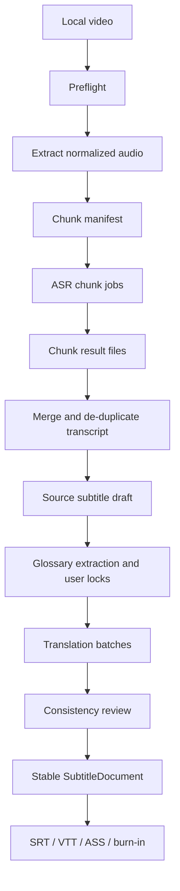

# Diplomat 0.35 Long-Video Runtime Optimization Design

Date: 2026-06-14
Status: Approved direction, documentation in progress
Target: 0.31 through 0.35

## Summary

Diplomat 0.35 is the long-video runtime optimization line. It takes the 0.3 release-candidate product surface and turns the local desktop workflow into a reliable production path for one to three hour videos on Windows, with NVIDIA GPU systems as the recommended environment.

The 0.35 line is not primarily a feature expansion. Its purpose is runtime ownership, recoverable long tasks, efficient local inference, translation consistency, and release-grade stress validation. The existing stack remains valid: Tauri, React, FastAPI, SQLite, JSON subtitle documents, FFmpeg, faster-whisper, CTranslate2, SentencePiece, Transformers, PyTorch, and Hugging Face model delivery. The work is to use those technologies through stronger production boundaries.

## Product Goal

A user can install the Windows desktop app, download curated models, import a one to three hour video, run local ASR, translate Chinese-English subtitles, recover from interruption, edit, export subtitle files, and render burned-in subtitles without opening a terminal.

## Non-Goals

- No cloud transcription or cloud translation path.
- No model weights committed into the source repository.
- No batch processing multiple videos.
- No account system, collaboration, sync, billing, or mobile app.
- No broad multilingual quality guarantee beyond Chinese-English.
- No full nonlinear video editor features.
- No guarantee that low-end CPU-only systems process long videos comfortably.

## Stage Map

| Version | Theme | Outcome |
| --- | --- | --- |
| 0.31 | Self-contained desktop runtime | The installed app owns Worker startup, packaged runtime discovery, FFmpeg/FFprobe paths, logs, and clean Windows smoke behavior. |
| 0.32 | Recoverable long-media ASR | Long media is split into recoverable chunks; ASR writes chunk checkpoints and resumes after interruption. |
| 0.33 | Model runtime performance | Model loading, GPU/CPU profiles, CTranslate2 batching, memory diagnostics, and benchmark reports are formalized. |
| 0.34 | Long-video translation consistency | Batch translation, glossary extraction, terminology locking, and global consistency checks support long videos. |
| 0.35 | Stability and release gate | One-hour and three-hour real-video tests, crash recovery, installer smoke, and release readiness gates define acceptance. |

## Architecture Direction

### Desktop Runtime

The desktop shell must stop depending on a developer checkout. Development mode may keep the repository-backed Worker launcher, but packaged mode must launch a release-owned Worker executable or sidecar and use application-owned directories under the Windows user profile.

Tauri sidecars are the preferred packaging mechanism for the Worker executable. FFmpeg and FFprobe should be bundled as release-approved resources or sidecars with explicit license evidence. Runtime status must report the actual packaged paths used by the Worker.

### Worker Long-Task Engine

The Worker must evolve from a simple background task runner into a recoverable long-task engine. Long-running jobs should be decomposed into stages:

1. `preflight`
2. `extract_audio`
3. `chunk_audio`
4. `transcribe_chunks`
5. `merge_transcript`
6. `translate_batches`
7. `consistency_review`
8. `build_subtitle_document`
9. `export`

Each stage writes a manifest. Each chunk or batch writes its own output atomically. The task state in SQLite points to the latest valid manifest and exposes recoverable progress to the UI.

### ASR Pipeline

ASR must process chunks intentionally instead of handing one full audio file to the provider. The chunker should combine a maximum duration bound with silence or VAD-aware split points. Overlap is allowed to preserve speech continuity, but merge logic must remove duplicate words and keep timestamps monotonic.

The first implementation can use deterministic fixed chunks with overlap plus merge rules, then extend to silence/VAD when verified. The acceptance path for 0.32 requires chunk checkpoints and resume before advanced split quality.

### Translation Pipeline

Translation should move from isolated line-by-line calls to batch translation with explicit context. The default long-video translation path should prioritize CTranslate2-backed OPUS-MT for stability and throughput. Local LLM translation remains available as a high-quality slower path when hardware supports it.

Long-video translation must maintain a project glossary. The glossary stores source terms, preferred target translations, confidence, user lock state, and provenance. Translation batches receive the glossary plus a bounded context window. A final consistency pass identifies terminology drift, empty translations, duplicate translations, and likely overlong subtitles.

### Model Runtime

Model runtime behavior must be visible and predictable:

- preflight detects CUDA availability and model compatibility.
- model profiles define device, compute type, batch size, and recommended hardware.
- installed model state includes health checks.
- tasks report model load, warmup, inference, and memory-related failures.
- GPU out-of-memory errors produce actionable fallback suggestions.

## Data Flow

## Error Handling

Every long-running failure must be actionable:

- missing FFmpeg or FFprobe points to runtime settings.
- missing model opens the model manager.
- checksum mismatch blocks model usage.
- CUDA unavailable suggests CPU profile or smaller model.
- out-of-memory suggests smaller model, lower batch size, or CPU fallback.
- corrupt chunk output allows re-running the affected chunk.
- app restart resumes from the latest valid manifest.
- canceled jobs preserve completed stage output unless the user explicitly clears cache.

## Testing Strategy

Default automated tests must not require real model downloads, GPU, network access, or multi-hour fixtures. They use fake providers, short generated media, and fixture manifests.

Release and long-video acceptance are separate opt-in test layers:

- 10 minute synthetic or fixture video smoke.
- one hour operator-provided video.
- three hour operator-provided video.
- Worker crash and restart during ASR.
- app close and reopen during translation.
- FFmpeg failure and recovery.
- model missing and model health failure.

## Stage Process

Each 0.01 stage follows the same process:

1. Start from clean `main`.
2. Create a branch with the `codex/` prefix.
3. Write or update the stage development document.
4. Write the stage implementation plan.
5. Implement in focused commits.
6. Run focused tests during implementation.
7. Run full repository verification.
8. Run stage-specific manual or opt-in verification.
9. Write a stage gate review.
10. If accepted, merge to `main`.
11. Push `main` to GitHub.
12. Begin the next stage.

If any verification, review, merge, or push step fails, the stage does not advance. The failure is recorded as a blocker and fixed before retrying.

## References

- Tauri 2 sidecar packaging supports `bundle.externalBin` for external binaries.
- Tauri 2 resource packaging supports `bundle.resources` for additional bundled files.
- faster-whisper remains the ASR runtime target.
- CTranslate2 remains the preferred high-throughput translation runtime.

