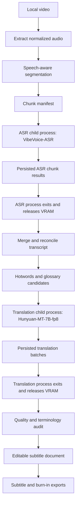

# Diplomat 0.4 Real-Model Desktop Migration Design

Date: 2026-06-18
Status: Approved direction, design draft ready for review
Target: 0.36 through 0.40

## Summary

Diplomat 0.4 is the real-model desktop migration line. It moves the product from a repository-verified 0.35 stability release to a desktop workflow that can complete a representative three-hour course, lecture, or tutorial video using real local models.

The 0.4 release has three major goals:

1. Redesign the desktop interface into a professional Material Design 3 inspired workstation.
2. Integrate real local ASR and translation models through project-local model directories and release-safe manifests.
3. Replace fixed-duration chunking with intelligent course-oriented segmentation, then verify that the full video-to-subtitle-to-translation-to-export workflow actually runs.

The release is accepted only when a three-hour video can run end-to-end with recoverable ASR chunks, translation batches, model memory isolation, editable subtitles, and exported results.

## Accepted Model Direction

The ASR target model is `microsoft/VibeVoice-ASR`.

- Hugging Face: <https://huggingface.co/microsoft/VibeVoice-ASR>
- Official implementation: <https://github.com/microsoft/VibeVoice>
- License signal: MIT.
- Product use: long-form ASR with timestamps, speaker-aware structured transcription, multilingual recognition, and hotword support.

The 0.4 translation target model is `tencent/Hunyuan-MT-7B-fp8`.

- Hugging Face: <https://huggingface.co/tencent/Hunyuan-MT-7B-fp8>
- Related base model: <https://huggingface.co/tencent/Hunyuan-MT-7B>
- Official implementation: <https://github.com/Tencent-Hunyuan/Hunyuan-MT>
- License signal: Tencent Hunyuan Community License from the model repository.
- Product use: local subtitle translation through a Hunyuan prompt-based translation provider.

The later high-quality translation target is `tencent/Hy-MT2-30B-A3B`, but it is not a 0.4 acceptance dependency.

- Hugging Face: <https://huggingface.co/tencent/Hy-MT2-30B-A3B>
- Reason deferred: the original model is too large for a stable 24 GB VRAM default path, and the product must first prove the staged real-model workflow.

## Target Hardware

The local development and acceptance target is a Windows desktop with:

- NVIDIA RTX 5090D V2 with 24 GB VRAM.
- 96 GB system RAM.
- Python 3.12.
- FFmpeg and FFprobe available through the desktop runtime.
- Enough local disk for model files, intermediate audio, chunk outputs, export outputs, logs, and evidence files.

The target hardware is strong enough for 0.4, but VRAM must be treated as a constrained resource. ASR and translation models must not be kept resident at the same time.

## Non-Goals

- Do not make `tencent/Hy-MT2-30B-A3B` a 0.4 acceptance requirement.
- Do not commit model weights to GitHub.
- Do not require cloud ASR or cloud translation.
- Do not require low-end CPU-only machines to process three-hour videos.
- Do not replace Diplomat with a full nonlinear video editor.
- Do not make NVIDIA NeMo the only segmentation path unless it proves stable on the target machine.

## Stage Map

| Version | Theme | Outcome |
| --- | --- | --- |
| 0.36 | Material 3 desktop workstation | The app looks and behaves like a polished desktop subtitle workstation, with professional layout, component states, navigation, and diagnostics. |
| 0.37 | Model directory and manifest system | Project-local development model folders, Git ignore rules, model manifests, license metadata, download checks, and runtime profile records are in place. |
| 0.38 | Intelligent long-audio ASR | Three-hour media is segmented with speech-aware boundaries, transcribed with VibeVoice-ASR in isolated ASR execution, persisted chunk-by-chunk, and merged. |
| 0.39 | Hunyuan translation pipeline | Hunyuan-MT-7B-fp8 translates subtitle batches with glossary, hotword, and context support after ASR memory is released. |
| 0.40 | Three-hour release gate | The full desktop workflow is verified with a three-hour video, crash/resume evidence, memory evidence, export evidence, and a stage gate review. |

## Desktop UI Direction

The 0.4 UI should be inspired by Material Design 3 foundations and components, not copied as a mobile interface.

References:

- Material Design 3 foundations: <https://m3.material.io/foundations>
- Material Design 3 components: <https://m3.material.io/components>
- Material Web: <https://material-web.dev/>

The product should feel like a desktop workstation:

- Left navigation rail for Projects, Workbench, Models, Tasks, Settings, and Help.
- Top app/status bar for current project, worker status, model state, active job, and language selection.
- Main workbench with video preview, subtitle grid, timeline, and task progress.
- Right inspector for line details, ASR settings, translation settings, export settings, glossary, and diagnostics.
- Bottom or collapsible task monitor for long-running chunk and batch progress.

Material 3 should guide:

- color tokens and surface hierarchy.
- accessible contrast.
- icon button usage.
- navigation rail behavior.
- filled, tonal, outlined, and text button roles.
- input, menu, tab, chip, progress, dialog, and snackbar states.
- density suitable for repeated desktop work.

The UI must avoid marketing-page styling. It should prioritize scanning, editing, progress visibility, recovery actions, and confidence during multi-hour jobs.

## Model Storage Design

Development model files live under the repository workspace, but model weights are never committed.

```text
models/
  README.md
  .gitignore
  manifests/
    vibevoice-asr.json
    hunyuan-mt-7b-fp8.json
  dev/
    asr/
      microsoft--VibeVoice-ASR/
        .gitkeep
    translation/
      tencent--Hunyuan-MT-7B-fp8/
        .gitkeep
```

GitHub receives:

- folder structure.
- `.gitkeep` files.
- manifest files.
- model configuration templates.
- license and source metadata.
- download and verification scripts.

GitHub does not receive:

- `.safetensors`
- model cache files.
- tokenizer cache duplicates.
- generated runtime cache.
- local benchmark artifacts.
- acceptance videos or exports.

The Worker model manager must understand two roots:

- development root: `models/dev`.
- installed app root: user-local application model directory.

This lets 0.4 use project-local model files during development while keeping the packaging path compatible with later installer behavior.

## Intelligent Segmentation Design

The segmentation problem is not only silence detection. Course, lecture, and tutorial videos need segment boundaries that preserve teaching units and professional terminology.

The 0.4 segmentation engine has three layers.

### Layer 1: Speech Activity

Default stable path: Silero VAD.

- Official repository: <https://github.com/snakers4/silero-vad>
- Reason: lightweight, local, CPU-capable, ONNX-capable, and suitable for avoiding GPU contention.
- Role: detect speech and non-speech intervals.

Experimental advanced path: NVIDIA NeMo diarization or segmentation.

- Official docs: <https://docs.nvidia.com/nemo-framework/user-guide/latest/nemotoolkit/asr/speaker_diarization/intro.html>
- Reason: stronger speech intelligence, diarization, speaker-aware segmentation, and research-grade pipelines.
- Role: evaluate whether it produces better course-video boundaries on the target machine.
- Gate: it can become default only if it completes representative media reliably without undermining the three-hour release target.

### Layer 2: Boundary Scoring

The chunk planner assigns each candidate boundary a score. High-scoring boundaries include:

- long silence.
- low audio energy.
- section-length pause.
- speaker change.
- gap near punctuation after ASR refinement.
- distance from previous boundary within configured min/max duration.
- no overlap with detected active speech.

Low-scoring boundaries include:

- continuous speech.
- high energy.
- likely mid-word or mid-sentence location.
- too close to the previous boundary.
- inside a hotword or protected term span.

The planner targets 20-40 minute chunks for course videos, with a hard upper bound chosen by runtime profile. For VibeVoice-ASR, the hard bound must stay below the model's practical long-audio limit and leave memory headroom.

### Layer 3: Semantic Protection

The system protects course concepts through:

- user-provided hotwords.
- automatically extracted candidate terminology.
- protected term spans.
- overlap around boundaries.
- ASR timestamp reconciliation.
- translation glossary prompts.
- post-translation terminology audit.

If the audio has no usable silence for too long, the system may force a split. Forced splits must be marked with `boundaryRisk: "forced"` in the manifest so the UI and review tools can surface the risk.

## Processing Architecture

The 0.4 processing architecture is stage-isolated.



The main Worker remains the coordinator. Heavy model inference happens in dedicated child processes.

This is required because the reliable way to release GPU memory after a large model stage is to terminate the process that owns the model. `torch.cuda.empty_cache()` can be used inside the child process, but it is not the primary memory-release guarantee.

## ASR Stage

The ASR stage:

- starts after segmentation writes a valid manifest.
- launches a dedicated ASR child process.
- loads VibeVoice-ASR only inside that child process.
- processes chunks sequentially by default.
- writes one chunk result file per completed chunk.
- writes raw model output, normalized segments, speaker labels when available, timestamps, hotword metadata, and diagnostics.
- exits when all chunks are complete or when cancellation/failure is recorded.

ASR chunk results must be reusable across retry. If chunk 9 fails in a three-hour video, retry must not rerun chunks 1-8 unless their outputs are invalid.

The ASR provider must support hotwords for professional terms. Hotwords can come from:

- user project glossary.
- imported term list.
- project title and metadata.
- previously extracted terms from completed chunks.

## Translation Stage

The translation stage:

- starts only after ASR has completed or reached a resumable accepted state.
- verifies that the ASR child process has exited.
- launches a dedicated translation child process.
- loads Hunyuan-MT-7B-fp8 only inside that child process.
- translates subtitle batches with bounded context windows.
- uses prompt templates based on Hunyuan-MT recommendations.
- includes glossary terms and hotwords when relevant.
- writes completed batches after each successful batch.
- exits after completion, cancellation, or failure.

The prompt must instruct the model to output only the translated subtitle text. It must not include explanations in the output.

Translation batch results must preserve manual edits. The default mode remains `missing_only`; overwrite behavior requires an explicit snapshot before replacement.

## Memory Lifecycle

0.4 must make memory lifecycle observable.

Required lifecycle events:

1. before ASR model load.
2. after ASR model load.
3. after each ASR chunk.
4. after ASR child process exit.
5. before translation model load.
6. after translation model load.
7. after each translation batch.
8. after translation child process exit.

For each event, the diagnostic report should record:

- timestamp.
- process id.
- stage.
- GPU name when available.
- GPU memory used and total when available.
- system memory used and total when available.
- model id.
- chunk or batch id when applicable.

This evidence is part of the 0.40 release gate.

## Recovery And Error Handling

All long-running outputs must be recoverable.

ASR recovery:

- valid chunk manifest persists.
- completed chunk outputs persist.
- corrupt chunk output is rejected and rerun.
- canceled ASR job preserves completed chunks.
- failed ASR job can retry from the first missing or invalid chunk.

Translation recovery:

- completed batches persist after each batch.
- canceled translation preserves completed batches.
- failed translation can retry only missing or failed lines.
- manual edits remain protected unless overwrite mode is selected.

Segmentation recovery:

- segmentation manifest persists.
- forced boundary risk is recorded.
- segmentation can be rerun without deleting completed ASR outputs unless the new manifest invalidates chunk boundaries.

Model errors:

- missing model opens model manager guidance.
- license not acknowledged blocks model use.
- checksum mismatch blocks model use.
- CUDA unavailable gives CPU or smaller-profile guidance.
- CUDA out of memory suggests smaller chunks, FP8 profile, lower context, or closing other GPU workloads.

## Testing Strategy

Default automated tests remain lightweight and deterministic.

They must not require:

- real model downloads.
- GPU.
- network.
- three-hour media.
- Docker.
- vLLM.

Automated tests use:

- fake VAD output.
- fake segmentation manifests.
- fake ASR child process.
- fake translation child process.
- short generated audio fixtures.
- small fixture subtitle documents.

Opt-in acceptance tests verify real behavior:

- model directory verification.
- VibeVoice-ASR smoke on a short clip.
- Hunyuan-MT-7B-fp8 smoke on a short subtitle set.
- one-hour course-video rehearsal.
- three-hour course-video release gate.
- ASR interruption and retry.
- translation interruption and retry.
- GPU memory release after ASR process exit.
- GPU memory release after translation process exit.
- final export verification.

## 0.40 Acceptance Criteria

Diplomat 0.4 is accepted only when all of the following are true:

- A representative three-hour course, lecture, or tutorial video completes the full workflow.
- The desktop app can run the workflow without manual terminal orchestration after required models are installed.
- Speech-aware segmentation avoids obvious mid-speech boundaries in the acceptance video.
- Any forced boundary is recorded and visible in diagnostics.
- VibeVoice-ASR runs in an isolated ASR process.
- ASR child process exits before translation model load.
- GPU memory evidence shows ASR memory is released before translation starts.
- Hunyuan-MT-7B-fp8 runs in an isolated translation process.
- Translation child process exits after completion.
- GPU memory evidence shows translation memory is released after translation finishes.
- ASR chunk outputs persist and support retry.
- Translation batch outputs persist and support retry.
- The resulting subtitle document is editable in the Workbench.
- Source subtitles, translated subtitles, and at least one export format are generated.
- Full repository automated verification passes.
- Stage gate documentation records model versions, hardware, media duration, memory evidence, recovery evidence, and known limitations.
- GitHub `main` contains the accepted 0.4 state and the release tag is pushed.

## Key Risks

### VibeVoice-ASR Integration Risk

VibeVoice-ASR may require dependency versions, CUDA behavior, or runtime settings that differ from the existing faster-whisper path. The mitigation is to isolate it behind a provider interface and child process runner.

### NVIDIA NeMo Complexity Risk

NVIDIA NeMo may produce better segmentation but carries heavier environment and dependency cost. The mitigation is to treat NeMo as an experimental advanced segmenter in 0.4 until it proves stable on target hardware.

### Hunyuan License Risk

Hunyuan-MT uses Tencent's community license. The mitigation is to require license metadata, explicit local acceptance, and a release legal-readiness gate before public distribution.

### Three-Hour Acceptance Risk

Three-hour verification depends on representative local media and real model runtime. The mitigation is to keep automated tests lightweight while requiring opt-in operator evidence before 0.4 acceptance.

### UI Scope Risk

The UI redesign can become too broad. The mitigation is to focus 0.36 on shared design tokens, shell layout, model/task visibility, and Workbench ergonomics before deeper feature polish.

## References

- Material Design 3 foundations: <https://m3.material.io/foundations>
- Material Design 3 components: <https://m3.material.io/components>
- Material Web: <https://material-web.dev/>
- VibeVoice-ASR model: <https://huggingface.co/microsoft/VibeVoice-ASR>
- VibeVoice official repository: <https://github.com/microsoft/VibeVoice>
- VibeVoice ASR docs: <https://github.com/microsoft/VibeVoice/blob/main/docs/vibevoice-asr.md>
- VibeVoice vLLM ASR docs: <https://github.com/microsoft/VibeVoice/blob/main/docs/vibevoice-vllm-asr.md>
- Hunyuan-MT-7B-fp8 model: <https://huggingface.co/tencent/Hunyuan-MT-7B-fp8>
- Hunyuan-MT-7B model: <https://huggingface.co/tencent/Hunyuan-MT-7B>
- Hunyuan-MT official repository: <https://github.com/Tencent-Hunyuan/Hunyuan-MT>
- Hy-MT2-30B-A3B model: <https://huggingface.co/tencent/Hy-MT2-30B-A3B>
- Silero VAD: <https://github.com/snakers4/silero-vad>
- NVIDIA NeMo speaker diarization docs: <https://docs.nvidia.com/nemo-framework/user-guide/latest/nemotoolkit/asr/speaker_diarization/intro.html>
